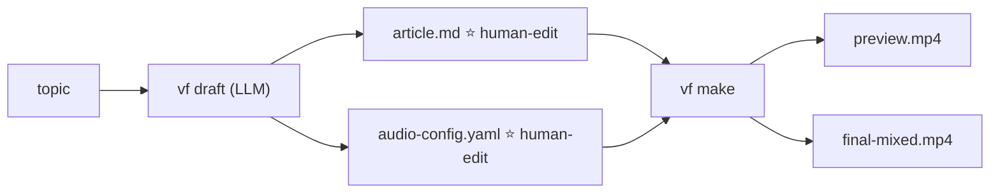

# AI Video Factory

Installation and usage manual for the current repository.

## Overview

As of v0.3.9, AI Video Factory exposes only **two commands** — one LLM
call writes both human-edit files in one go, and one command that
renders the video:



The two human-edit files are **`article.md`** (narrative + a Scenes YAML
block) and **`audio-config.yaml`** (voice / bgm / sfx / fades). Everything
else is derived; `vf make` is idempotent — it skips a step when its
output is newer than its inputs (`--dry-run` shows what it would do).

## 1. Requirements

Required:

- Node.js 22 or newer
- npm
- FFmpeg, including `ffprobe`
- macOS, Linux, or Windows with a POSIX-compatible shell for `bin/video`

Check the versions:

```bash
node --version
npm --version
ffmpeg -version
ffprobe -version
```

For macOS:

```bash
brew install node ffmpeg
```

For Debian or Ubuntu:

```bash
sudo apt-get update
sudo apt-get install -y ffmpeg
```

On Windows, install Node.js from nodejs.org and FFmpeg from an approved
package manager or ffmpeg.org. Ensure both `node` and `ffmpeg` are on `PATH`.

## 2. Installation

From the repository root:

```bash
pnpm install
ppnpm run build
```

The build compiles all workspace packages into `packages/*/dist`.

The CLI is currently invoked through the compiled entry point:

```bash
node packages/cli/dist/index.js --help
```

For a shorter command in the current shell, define:

```bash
alias vf='node packages/cli/dist/index.js'
```

The repository also provides a wrapper for agentic shells and automation:

```bash
bin/video --help
```

### Global installation

After the `@vf/*` packages have been published, install the CLI globally:

```bash
npm install --global @vf/cli
vf --help
```

The global package contains the CLI and runtime dependencies. It does not
create files in its installation directory. Projects are created in the
current working directory, or below the directory passed with `--cwd`:

```bash
mkdir my-video-projects
cd my-video-projects
vf new demo
```

For local development, link the workspace CLI instead of publishing it:

```bash
npm run build
npm link --workspace @vf/cli
vf --help
```

Maintainers publish the workspace packages together:

```bash
npm run publish:packages:dry-run
npm run publish:packages
```

After source changes, rebuild before using the CLI:

```bash
npm run build
```

## 3. Verify the installation

Run the type check and tests:

```bash
npm run build
pnpm test
```

Other project checks:

```bash
pnpm run lint
ppnpm run format:check
npm run benchmark:verify
pnpm run acceptance
```

`benchmark:verify` and `acceptance` render video and therefore require FFmpeg,
ffprobe, and a working local Remotion renderer. Some provider integration tests
require local loopback sockets and are not a substitute for live API testing.

## 4. Create a project

Create a project scaffold under `projects/<project-id>`:

```bash
node packages/cli/dist/index.js new demo
```

This creates:

```text
projects/demo/
├── project.yaml
├── storyboard/storyboard.yaml
├── vdsl/vdsl.yaml
├── assets/audio/
├── assets/images/
├── assets/fonts/
├── captions/
├── checkpoints/
├── runs/
├── output/
└── state.yaml
```

The generated storyboard is the main input. Edit:

```text
projects/demo/storyboard/storyboard.yaml
```

The project starts in `DRAFT` state. The workflow state is stored in
`state.yaml`; run records are stored in `runs/`.

## 5. Minimal storyboard format

The current VDSL schema is `0.1`. Durations are seconds; the renderer converts
them to frames using the project FPS.

```yaml
schema_version: "0.1"

project:
  id: demo
  language: zh-CN
  fps: 30
  width: 1920
  height: 1080

style:
  theme: dark-tech

scenes:
  - id: scene-01
    duration: 8
    narration:
      text: "AI Agent 为什么需要 Memory？"
    visual:
      component: Title
      props:
        text: "AI Agent 为什么需要 Memory？"
    animation:
      entrance: fade
      emphasis: none
      exit: none
    captions:
      source: narration
    transition:
      in: fade
      out: cut
```

Important rules:

- `schema_version` must be `"0.1"`.
- Scene IDs must be unique.
- Each scene needs a positive `duration` and a registered visual component.
- Unknown fields are rejected.
- Referenced assets must exist under the project root.
- Supported languages are `zh-CN` and `en-US`.

The current component registry includes `Title`, `Paragraph`, `Image`,
`CodeBlock`, `Terminal`, `Callout`, `FlowChart`, `Timeline`, `Comparison`,
and `EndCard`.

## 6. Core local workflow (v0.4 recommended)

The new local flow is collapsed to a single `vf make` command.

### 6.1 One-time prep: `article.md` + `audio-config.yaml`

```bash
vf new my-topic
vf draft "my-topic"           # → projects/<slug>/article.md + audio-config.yaml
                            #   also refreshes storyboard.yaml (VDSL, derived from article.md)
# (vf audio-plan my-topic is only needed to REGENERATE audio-config.yaml
#  after hand-editing article.md — the draft command already ran it)

# Then human edits:
$EDITOR projects/<slug>/article.md
$EDITOR projects/<slug>/audio-config.yaml
```

`vf draft` runs the audio-plan step on the fresh article automatically.
Two guardrails: `--no-audio-plan` skips the step (article only), and an
existing `audio-config.yaml` is never overwritten — hand edits win, and
the command prints a note pointing at `vf audio-plan` when it kept one.
If the audio-plan LLM call fails, the draft still succeeds (article.md
is the primary artifact) with a hint to run `vf audio-plan` separately.

To start from your own idea instead of a blank topic, pass
`--file <path>` with a text or markdown file. The LLM uses it as the
**major idea / opinions seed** — it polishes wording, structure, and
flow, but must not change any opinion you expressed. (Mutually exclusive
with `--from`, which revises an existing draft.)

### 6.2 Render with one command: `vf make`

Every verb that takes a `<project>` argument resolves it the same
forgiving way, in order:

1. a direct path to a project root (e.g. `./projects/my-video`)
2. the exact folder name under `projects/`
3. the human topic — slugified, case- and separator-insensitive
   (`"Harness Engineering"`, `harness_engineering`, and
   `harness-engineering` all find the same project)
4. a unique folder-name prefix (`vf make 长视频` finds `长视频测试`)

An ambiguous prefix errors listing the candidates; a zero-match error
lists every available project.

```bash
vf make my-topic                                  # TTS → audio assets → render → mix
vf make my-topic --fake                           # offline: silent placeholder WAVs + no AI images
vf make my-topic --image-provider mock            # force mock images (64×36 placeholders) for offline testing
vf make my-topic --image-provider minimax         # force real AI image generation (needs MINIMAX_API_KEY)
vf make my-topic --bgm-dir ~/audio/bgm --sfx-dir ~/audio/sfx  # real BGM/SFX from your library
vf make my-topic --dry-run                        # print what would run, do not execute
```

`--fake` is the canonical offline mode: it skips both Edge TTS (writing
silent placeholder WAVs) and real image generation. Scenes stay as
`AnimatedIllustration` (caption + animated SVG) so the rendered video is
visible end-to-end without any network access. Pass `--image-provider
mock` explicitly only when you want to exercise the `ImageBackground`
path with placeholder images.

`--bgm-dir` / `--sfx-dir` point at your own audio library. The tag in
`audio-config.yaml` (`bgm: calm`, `sfx: {scene_1: whoosh}`) resolves to
`{tag}.wav` inside the directory (exact name first, then any `.wav`
containing the tag). Without the flags the audio-assets step writes a
1-second **silent mock placeholder** — the mix machinery runs, but you
are ducking silence. With the flags, real audio lands in
`assets/audio-assets/` and `vf mix` layers it under the narration
(ducked ~-18 dB). A sibling `{tag}.license.txt` is recorded on the make
report so provenance is visible. A missing tag fails the
`audio-assets` step readably — add the file or drop the cue.

Outputs:

```text
projects/<slug>/output/preview.mp4           # visual preview
projects/<slug>/output/preview-faststart.mp4 # same, faststart metadata
projects/<slug>/output/final-mixed.mp4       # narration + BGM + SFX — the publishable artifact
projects/<slug>/assets/audio/scene_*.wav
projects/<slug>/assets/audio-assets/{bgm,sfx}/*.wav
projects/<slug>/captions/<lang>.srt
```

### 6.3 Re-run after editing

`vf make` is **idempotent** — outputs newer than inputs are skipped. So
when you edit either human-edit file and re-run, only the affected step
re-executes:

```bash
# You changed only audio-config.yaml's BGM tag
vf make my-topic
# → skips already-fresh TTS + preview; re-runs audio-assets + mix
```

### 6.4 Validate the lower-level format (optional)

```bash
node packages/cli/dist/index.js validate \
  projects/<slug>/storyboard/storyboard.yaml \
  --root projects/<slug>
```

Reports file / line / field / reason on errors.


## 7. Editing, iteration, and recovery

The new flow no longer needs `approve` / `reject` / `rollback` — **edit
the file, re-run `vf make`**:

```bash
# Tweaked a narrative section in article.md
$EDITOR projects/<slug>/article.md
vf make <slug>          # only TTS + render + mix re-execute (rest is skipped)

# Tweaked audio-config.yaml
$EDITOR projects/<slug>/audio-config.yaml
vf make <slug>          # only audio-assets + mix re-execute

# Want a specific scene to use a different component (e.g. Image instead of Paragraph)
$EDITOR projects/<slug>/storyboard.yaml
vf make <slug>          # only render + mix re-execute
```

`vf make` does not produce a review checkpoint — its output,
`final-mixed.mp4`, is the publishable artifact.

### About hand-editing `storyboard.yaml`

`storyboard.yaml` is derived from `article.md` and gets refreshed on
every `vf draft` run. Additionally, `vf make` rewrites each scene's
`duration:` field after TTS to match the actual measured audio length —
without this, the renderer would use the article's planned duration and
freeze on a still frame when audio plays past it.

If you hand-edit `storyboard.yaml` (e.g. swap to the `Image` component
or tweak `props`):

- Per-scene `duration:` and other `vf draft`-derived fields get
  overwritten on the next `vf draft`.
- The per-scene `duration:` also gets overwritten on the next `vf make`
  (since it re-measures audio).
- Everything else (component choice, props, subtext, etc.) survives
  the next `vf make` because `syncStoryboardDurations` only touches the
  `duration:` line.

The supported flows are:

- Editorial tweaks → edit `article.md`, then `vf draft` regenerates
  storyboard.yaml cleanly.
- Pixel-level art direction → hand-edit `storyboard.yaml`, then run
  `vf make` directly. **Don't** re-run `vf draft` until you're ready
  to lose those tweaks.


## 8. Optional AI workflow

The AI commands use MiniMax and GLM-compatible APIs. They are optional for the
local render path.

Set credentials in the shell environment; never commit them to the repository:

```bash
export MINIMAX_API_KEY="..."
export GLM_API_KEY="..."
```

Default provider routing is defined in `packages/llm/src/config.ts`:

```yaml
research:
  primary: glm
  fallback: minimax
script:
  primary: minimax
  fallback: glm
storyboard:
  primary: minimax
  fallback: glm
review:
  primary: glm
  fallback: minimax
```

To use a custom routing file:

```bash
export LL_CONFIG="$PWD/llm.config.yaml"
```

### Provider fallback on quota / rate-limit errors

When the primary provider returns a quota or rate-limit error (HTTP 429
/ 402 / 403, or response bodies containing `insufficient_balance`,
`quota_exceeded`, `rate_limit`), each AI command automatically retries
once with the configured fallback before failing the run. The
provider that actually served the request is recorded in
`runs/<id>.yaml` under `provider:` — so users can audit whether
fallback kicked in.

Override the routing per-command:

```bash
vf draft "topic" --model minimax   # force minimax (no fallback to glm)
vf storyboard "topic" --model glm --lang en-US
```

A non-quota error from the primary (e.g. HTTP 400 invalid payload) is
**not** retried with the fallback — it surfaces immediately, because
the fallback provider would return the same error on the same input.

### v0.4 recommended: `vf draft` + `vf audio-plan`

The new AI workflow collapses to two commands producing the two human-edit
files:

```bash
# 1. Write article.md (consolidated narrative + Scenes YAML block)
vf draft "AI Agent Memory"
vf draft "AI Agent Memory" --no-web
vf draft "AI Agent Memory" --model glm --lang zh-CN --duration 60 --audience developers
vf draft "AI Agent Memory" --from outline.md   # revise an existing outline

# 2. Write audio-config.yaml from the parsed article
vf audio-plan ai-agent-memory
```

Outputs:

```text
projects/<slug>/article.md           # human edits: narrative + Scenes YAML
projects/<slug>/audio-config.yaml    # human edits: voice / bgm / sfx / fades
```

After human edits to these two files, `vf make <slug>` produces the
publishable mp4 in a single command.


### YouTube package

Not part of `vf make`; invoke separately when needed:

```bash
vf youtube <slug>
```

Writes title, description, WebVTT chapters, package YAML, thumbnail
prompt, and Shorts hook under `youtube/`. Does **not** upload to YouTube
nor generate the thumbnail / Shorts MP4 (those come from `vf thumbnail`
and `vf shorts` — see §12.5).

## 9. Voice, subtitles, and audio (v0.4)

### 9.1 Recommended: subsumed into `vf make`

As of v0.4, TTS, BGM/SFX assets, mixing, and SRT subtitles are all
produced by `vf make` in one invocation — no need for separate `vf audio`,
`vf audio-asset`, or `vf mix` calls:

```bash
vf make <slug>           # real Edge TTS (requires network)
vf make <slug> --fake    # silent placeholder WAVs + no AI images (offline / CI-friendly)
vf make <slug> --image-provider minimax  # force real AI image generation (default when not --fake)
```

Default provider is Edge TTS (free, no API key). It depends on the
online Microsoft Edge TTS endpoint — rate limits and network failures
apply.

`--fake` also disables AI image generation (no `MINIMAX_API_KEY`
required). Scenes stay as `AnimatedIllustration` (caption + animated
SVG), so the rendered video is visible end-to-end without any network
access. Override with `--image-provider mock` (placeholders) or
`--image-provider minimax` (real AI).

By default the BGM/SFX tags in `audio-config.yaml` materialize as
1-second **silent mock placeholders** — the mixing machinery runs, but
there is no real music. Point `vf make` at your own library to get real
audio (`--bgm-dir`, `--sfx-dir`; see §6.2), or pre-seed
`assets/audio-assets/{bgm,sfx}/{tag}.wav` yourself (idempotent make
keeps existing files).

Outputs:

```text
projects/<slug>/assets/audio/scene_*.wav
projects/<slug>/assets/audio-assets/bgm/<tag>.wav
projects/<slug>/assets/audio-assets/sfx/<tag>.wav
projects/<slug>/captions/<lang>.srt
```

The `.srt` file is SRT-formatted (despite the extension), drop-in
compatible with most subtitle workflows.

### 9.2 Inter-sentence pauses (`pause_between_sentences_sec`)

Insert silence between sentences in TTS output by setting a single
field in `audio-config.yaml`:

```yaml
voice: zh-CN-XiaoxiaoNeural
bgm: "calm"
bgm_fade_in_sec: 1.5
bgm_fade_out_sec: 2
pause_between_sentences_sec: 1     # 1-second pause after every sentence
sfx: {}
```

- Range `0–5` seconds; `0` disables.
- Implementation: `vf make` wraps the text in `<speak>...</speak>`
  SSML with `<break time="Nms"/>` after each `.`, `!`, `?`, `。`, `！`,
  `？`. Edge TTS treats each `break` as literal silence in the audio.
- Typical values: `0.5–1.0` sec. `vf audio-plan` defaults to `0`;
  if a scene has 2+ sentences and you want clearer pacing, bump it up.
- Editing only this field and re-running `vf make` re-executes just the
  TTS step; mix/preview outputs are skipped because nothing they
  depend on changed.

### 9.3 Voice selection

The default voice depends on the article's `language` field. To override
per-project, edit `voice:` in `audio-config.yaml`. To change the global
default, edit `ZH_VOICE` / `EN_VOICE` in
`packages/make/src/index.ts` and re-build.

| Language | Default (male) | Female alt. | Other male alts |
| --- | --- | --- | --- |
| `zh-CN` | `zh-CN-YunjianNeural` (documentary-style) | `zh-CN-XiaoxiaoNeural` | `zh-CN-YunxiNeural` (warm), `zh-CN-YunyangNeural` (news) |
| `en-US` | `en-US-ChristopherNeural` (calm narration) | `en-US-AriaNeural` | `en-US-GuyNeural`, `en-US-EricNeural` |

Any voice ID listed by Edge TTS works — pass it as `voice:` in
`audio-config.yaml`. The LLM-generated article always uses the male
default unless your `voice:` line overrides it.

### 9.4 Edge TTS caveats

Edge TTS has no direct API charge, but commercial redistribution and
long-term production use should be checked against the service terms. To
replace with a formally licensed provider (MiniMax TTS, ElevenLabs,
etc.), implement the `TTSProvider` interface in `@vf/tts` and pass it to
`vf make` (CLI integration in a follow-up).


## 10. Project artifacts and provenance

### v0.4 recommended layout

```text
projects/<slug>/
├── project.yaml                     project metadata
├── article.md                       ⭐ human edits: narrative + Scenes YAML (vf draft writes)
├── audio-config.yaml                ⭐ human edits: voice / bgm / sfx / fades (vf audio-plan writes)
├── storyboard/storyboard.yaml       derived by vf draft from article.md; per-scene duration is re-measured after TTS by vf make (hand edits to other fields survive; durations get overwritten on the next make)
├── vdsl/vdsl.yaml                   normalized compiled VDSL
├── state.yaml                       state machine state (unused by `vf make`; retained for back-compat)
├── runs/<run-id>.yaml               per-LLM/tool-call run records
├── assets/
│   ├── audio/scene_*.wav           per-scene TTS (vf make writes)
│   └── audio-assets/{bgm,sfx}/     BGM/SFX assets (vf make writes)
├── captions/<lang>.srt              subtitles (vf make writes)
└── output/
    ├── preview.mp4                  vf make writes
    ├── preview-faststart.mp4        vf make writes
    └── final-mixed.mp4              ⭐ publishable artifact (vf make writes)
```

`⭐` marks the two human-edit files; everything else is derived.

`storyboard.yaml` is **derived from `article.md`** (every `vf draft`
run refreshes it from the parsed article). The first scene maps to
the `Title` component; the rest map to `Paragraph`; `caption` becomes
on-screen text. If you want pixel-level visual control (swap to
`Image`, tweak props), hand-edit `storyboard.yaml` and run `vf make`
— but the next `vf draft` **overwrites** your edits. If hand-edits
matter, run `vf make` directly without re-drafting.

### Run record fields

`runs/<run-id>.yaml` entries carry `provider`, `model`, `tokens`
(`{input, output}`), `prompt_hash`, `estimated_cost_usd`,
`input_files`, `output_files` references, and an ISO timestamp.

**Never** commit API keys, `.env`, private source material, tokens, or
cookies.

### Validation reports a missing asset

Paths such as `assets/audio/scene_01.wav` are relative to the project
root, not the directory containing the YAML file. Check the path and run:

```bash
vf validate projects/demo/storyboard/storyboard.yaml --root projects/demo
```

### `vf make` complains about missing files

`vf make` needs both `article.md` and `audio-config.yaml` at
`projects/<slug>/`. The error surfaces a hint for each missing file:

```text
article.md not found at .../article.md
# hint: run `vf draft <topic>` first

audio-config.yaml not found at .../audio-config.yaml
# hint: run `vf draft <topic>` first   # (yes, both files come out of vf draft + vf audio-plan together)
```

Run `vf draft <topic>` and `vf audio-plan <topic>` first, then re-run
`vf make`.

### Edge TTS fails

Check network access, retry later, or fall back to offline mode:

```bash
vf make <project> --fake
```

### `article.md has empty scene narrations`

Occasionally the LLM puts all prose in the `## N. ...` section bodies and
ships every scene's `narration:` field blank. All article-consuming verbs
(`vf make`, `vf audio-plan`, `vf youtube`) now auto-recover by
distributing the section bodies across the empty scenes — you'll see a
`recover-narrations` step (in `vf make`'s report) or a warning line
telling you how many scenes were back-filled.

To regenerate a clean draft instead:

```bash
vf draft <topic> --from projects/<slug>/article.md
```

For CI, keep the old fail-loudly behaviour on `vf audio-plan`:

```bash
vf audio-plan <project> --strict
```


### Remotion cannot find a port

Another process or the execution environment may prevent local port binding.
Stop stale render processes, retry with a clean shell, and verify that local
loopback sockets are permitted.

### Disk usage grows fast (`node_modules` / `/tmp`)

Two temp directories accumulate during heavy use:

- **`node_modules/.cache/webpack`** — Remotion's persistent webpack cache.
  Grows incrementally on every unique render config. Delete to reclaim
  space; the next render rebuilds it.

  ```bash
  rm -rf node_modules/.cache/webpack
  ```

- **System `$TMPDIR` (e.g. `/tmp` on Linux, `$TMPDIR` on macOS)** —
  `remotion-webpack-bundle-*` and `remotion-v*-assets-*` dirs from each
  Remotion render. Each render leaks ~26MB; hundreds of test/make runs
  can leave tens of GB. `vf make` sweeps these automatically every
  render (entries older than 1 hour), but other Remotion invocations
  (e.g. direct `vf preview` calls during local dev) may not. To
  reclaim now:

  ```bash
  # macOS default:
  rm -rf "$TMPDIR"/remotion-webpack-bundle-* "$TMPDIR"/remotion-v*-assets*
  # Linux:
  rm -rf /tmp/remotion-webpack-bundle-* /tmp/remotion-v*-assets*
  ```

## 12. Step-by-step: create a video from a topic

### 12.0 Recommended: 2-command minimal API (v0.3.9+)

The entire pipeline is **2 commands + 2 human-edit files + 1 rendered
output**:

1. `vf draft <topic>` → writes `article.md` and `audio-config.yaml`
   (LLM consolidates research + script + storyboard + audio plan in one
   call; `--no-audio-plan` skips the audio step; `--file <path>` seeds
   the draft with your raw idea (opinions preserved); an existing
   `audio-config.yaml` is never overwritten — regenerate with
   `vf audio-plan`)
2. `vf make <project>` → everything else: TTS → audio assets → render → mix → mp4


`vf make` is **idempotent** — outputs newer than inputs are skipped. Use
`--dry-run` to preview what would run without executing.

### 12.1 One-time setup

```bash
# ffmpeg (required for everything) + Node 22+
brew install ffmpeg                 # macOS; on Debian/Ubuntu: sudo apt install ffmpeg

git clone https://github.com/huangjien/ai-video-factory.git
cd ai-video-factory
npm install
npm run build
```

### 12.2 Scaffold a project

```bash
TOPIC="ai-thinking"
vf new "$TOPIC"
# Creates projects/<slug>/ with:
#   project.yaml
#   storyboard/storyboard.yaml    (template — 2 scenes, used by vf make rendering)
#   state.yaml
#   runs/, checkpoints/, output/, assets/, etc.
```

### 12.3 Two LLM commands (the recommended path)

Requires `GLM_API_KEY` (default) or `MINIMAX_API_KEY` in the environment.

```bash
# 1. Draft — writes article.md (combines research + script + storyboard in one)
#    Output: projects/<slug>/article.md
#      - YAML frontmatter (project / language / duration_target_sec / voice)
#      - # <title> + > **Hook**
#      - ## <n>. <Section> + <body> paragraphs (human-editable)
#      - ## Scenes  fenced YAML block (drives downstream tools)
#    Also derives storyboard.yaml (VDSL): first scene → Title, rest → Paragraph,
#    `caption` becomes on-screen text. `vf make` renders this file, so the
#    video length stays in sync with the audio automatically.
vf draft "$TOPIC"                  # default: enable MiniMax web search
vf draft "$TOPIC" --no-web          # disable web, model knowledge only
vf draft "$TOPIC" --model glm --duration 40 --lang zh-CN --audience developers
vf draft "$TOPIC" --from outline.md  # revise an existing outline
vf draft "$TOPIC" --file my-idea.md  # polish YOUR idea into an article; opinions preserved
```

```bash
# 2. Audio-plan — reads article.md's scenes, writes audio-config.yaml
#    One file holds all audio knobs (voice / bgm tag / sfx cues / fades)
vf audio-plan "$TOPIC"
```

Then human edits the two files:

```bash
$EDITOR "projects/$TOPIC/article.md"          # narrative, scene tweaks, durations
$EDITOR "projects/$TOPIC/audio-config.yaml"   # BGM tag, SFX cues, fades
```

### 12.4 Render with one command

```bash
vf make "$TOPIC"                       # TTS → audio assets → render → mix (real Edge TTS)
vf make "$TOPIC" --fake                # FakeTTSProvider (no network; silent placeholder WAVs + no AI images)
vf make "$TOPIC" --image-provider minimax  # force real AI image generation
vf make "$TOPIC" --dry-run             # print which steps would run; do not execute
```

`--fake` skips both Edge TTS and AI image generation, so the rendered
video is fully offline — scenes keep their `AnimatedIllustration`
component (caption + animated SVG). Use `--image-provider mock` to
exercise the `ImageBackground` path with placeholders.

Outputs:

```text
projects/$TOPIC/output/preview.mp4           # visual preview
projects/$TOPIC/output/preview-faststart.mp4 # same, faststart metadata
projects/$TOPIC/output/final-mixed.mp4       # narration + BGM + SFX — publishable artifact
projects/$TOPIC/assets/audio/scene_*.wav
projects/$TOPIC/assets/audio-assets/bgm/*.wav
projects/$TOPIC/assets/audio-assets/sfx/*.wav
projects/$TOPIC/captions/<lang>.srt
```

Not happy? Edit either human-edit file and re-run `vf make` — only the
affected steps re-execute.

### 12.5 Optional: YouTube package + thumbnail + Shorts

Publishing metadata is not part of `vf make`; invoke separately:

```bash
# YouTube text package — title, description, chapters.vtt, thumbnail prompt, Shorts hook
vf youtube "$TOPIC"
# Prefers article.md; falls back to research.md + script.md + storyboard.yaml
# when article.md is absent (back-compat with older projects).
# → projects/$TOPIC/youtube/{title.txt,description.md,chapters.vtt,thumbnail-prompt.txt,shorts-hook.txt}

# Thumbnail — uses mock by default; pass --provider minimax for real AI
vf thumbnail "$TOPIC"
# → projects/$TOPIC/youtube/thumbnail.png (1280x720)

# Shorts clip — extracts a vertical 9:16 segment from final-mixed.mp4
vf shorts "$TOPIC"
# → projects/$TOPIC/youtube/shorts.mp4
```

`vf youtube` no longer requires `research/`, `script/`, and
`storyboard/storyboard.yaml` triple to exist — if `article.md` is present,
it derives the title, hook, sections, and chapter timings from there.

Add `--provider minimax` to both for real AI (needs `MINIMAX_API_KEY` + quota):

```bash
vf thumbnail "$TOPIC" --provider minimax
vf shorts "$TOPIC"     --provider minimax
```

### 12.6 Inspect what shipped

```bash
ls "projects/$TOPIC/output/"
ls "projects/$TOPIC/assets/audio/"
ls "projects/$TOPIC/assets/audio-assets/"
ls "projects/$TOPIC/captions/"
ls "projects/$TOPIC/runs/"            # one run record per LLM/tool call
```

### 12.7 The canonical end-to-end in one block

A copy-paste-runnable summary (assumes `vf` is on PATH and `GLM_API_KEY`
is set; replace with `--fake` if offline):

```bash
TOPIC="ai-thinking"
vf new "$TOPIC"
vf draft "$TOPIC"                     # writes article.md + audio-config.yaml + derives storyboard.yaml
# (vf audio-plan "$TOPIC" is only needed to regenerate audio-config.yaml after hand-editing article.md)

# Human edits (any editor)
$EDITOR "projects/$TOPIC/article.md"
$EDITOR "projects/$TOPIC/audio-config.yaml"
# Want a 1-second pause between every sentence? Add it to audio-config.yaml:
#   echo 'pause_between_sentences_sec: 1' >> "projects/$TOPIC/audio-config.yaml"

vf make "$TOPIC"                  # → preview.mp4 + final-mixed.mp4

# Optional
vf youtube "$TOPIC"               # works directly off article.md
vf thumbnail "$TOPIC"
vf shorts "$TOPIC"
```

The publishable artifact is `projects/$TOPIC/output/final-mixed.mp4`
plus the YouTube package under `projects/$TOPIC/youtube/`.


## 13. Verifying with the acceptance audit

After running the above, `npm run acceptance` performs the §62.4 audit on
the `projects/benchmark-v01/` benchmark (39 s Chinese explainer about AI
chain-of-thought). The audit checks file format, runtime, and provenance
without an AI in the loop.

```bash
npm run acceptance
# Expect: "ALL 11 §62.4 acceptance checks passed"
```
