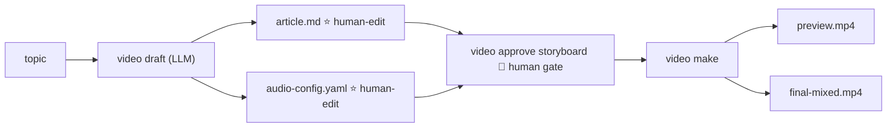
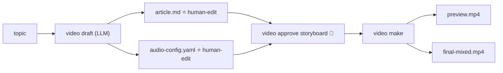

# AI Video Factory

Installation and usage manual for the current repository.

## TL;DR — generate something in ~3 minutes

One-time setup: Node 22+, pnpm, ffmpeg → `pnpm install && pnpm run build`,
then `alias video='node packages/cli/dist/index.js'` (all examples assume it).

### Path A — no API keys, fully offline (~60 s)

Render the committed MCP Explainer demo — SVG diagram draw-on + hand-drawn
canvas, with a real QA report:

```bash
video new mcp-explainer
cp examples/mcp-explainer/storyboard.yaml projects/mcp-explainer/storyboard/
cp examples/mcp-explainer/captions/zh-CN.srt projects/mcp-explainer/captions/
for i in 01 02 03 04 05; do
  ffmpeg -y -f lavfi -i anullsrc=r=44100:cl=mono -t 9 projects/mcp-explainer/assets/audio/scene-$i.wav
done
video approve storyboard --cwd projects/mcp-explainer   # 🚪 the one human gate
video preview --cwd projects/mcp-explainer              # add --draft for a faster 960×540 pass
# → projects/mcp-explainer/output/preview.mp4
```

### Path B — your own topic, with an LLM key

```bash
export GLM_API_KEY="..."      # or MINIMAX_API_KEY
video new my-first-video
video draft "why local-first tools win"          # LLM writes article.md + audio-config.yaml
$EDITOR projects/my-first-video/article.md    # optional: edit the draft
video approve storyboard --cwd projects/my-first-video   # 🚪 read it, then approve
video make my-first-video                        # TTS → images → render → mix
# → projects/my-first-video/output/final-mixed.mp4  (--fake = offline TTS + no AI images)
```

That's the whole product: **2 AI commands + 1 human approval + 2 editable
files** (`article.md`, `audio-config.yaml`). Deeper: walkthrough §12,
examples §14, troubleshooting §11, gates §7.1.

## Overview

AI Video Factory's core interface is **two AI commands + one human
approval** — one LLM call writes both human-edit files in one go, a human
reads and approves the storyboard, and one command renders the video:



The two human-edit files are **`article.md`** (narrative + a Scenes YAML
block) and **`audio-config.yaml`** (voice / bgm / sfx / fades). Everything
else is derived; `video make` is idempotent — it skips a step when its
output is newer than its inputs (`--dry-run` shows what it would do).

Rendering sits behind a **mandatory human gate**: until the storyboard is
approved, `video make` fails at the render step and prints the exact approve
command (calling `video preview --force` directly bypasses it, recorded in
the audit trail). The three gates and invariants live in
`docs/workflow.md`; the VDSL format in `docs/schema.md`; the system
architecture in `docs/architecture.md`.

## Harness adapters (v0.4.1)

The `video` CLI is the **stable harness-agnostic surface**. The repo ships
adapter files for the harnesses we officially support; every adapter
forwards to `video` (or to `bin/video`, a thin shell wrapper).

### Shell wrapper — `bin/video`

```bash
bin/video new "demo"
bin/video research "AI 思维链"
bin/video storyboard "AI 思维链" --from-research projects/.../research
bin/video preview --cwd projects/demo
```

Forwards every verb to `video` so any shell, Makefile, or CI script can
drive the pipeline with one binary. No harness required.

### OpenCode — `.opencode/command/video.md`

OpenCode / Cursor / Claude Code / similar agentic harnesses that look up
`.opencode/command/*.md` will pick up `/video` as a slash command. The
file uses OpenCode's frontmatter (`description`, `tools`) and a markdown
body listing every verb, the canonical pipeline order, and the
critical invariants (never auto-approve, credentials stay in env, fail
loudly).

### pi / oh-my-pi — `.omp/commands/video.md`

The `oh-my-pi` coding agent (`@oh-my-pi/pi-coding-agent`, `omp.sh`)
discovers native slash commands under `<cwd>/.omp/commands/*.md`. The
repo ships `.omp/commands/video.md` with the OMP-native frontmatter
(`name`, `description`) and the same canonical pipeline / invariants
body. Inside an `omp` interactive session the user types:

```bash
/video draft "AI 思维链"
/video approve storyboard --cwd projects/ai-思维链
/video make ai-思维链
/video retrospect ai-思维链
```

The command body uses `$ARGUMENTS` so the slash input maps verbatim to
the `video` CLI args. Permissions default to `read: allow, write/edit/bash:
ask` (in `.omp/settings.json`) to preserve the human-gate principle —
the agent can read freely but must ask before mutating anything.

#### Skills in OMP

`.agents/skills/<name>/SKILL.md` is the canonical skill source (per
`skills-lock.json`). For OMP, `.omp/skills/<name>/SKILL.md` are
symlinks that resolve to the canonical files — `readlink -f
.omp/skills/<name>/SKILL.md` shows the canonical path. `.omp/settings.json`
points `skills.customDirectories` at `.omp/skills` so OMP's native
provider picks them up alongside any others. To install new skills:

```bash
npx skills add <pack> --yes                       # updates canonical .agents/skills
ls -l .omp/skills/<new-skill-name>/SKILL.md        # verify the symlink is there
# (add it manually if not — single symlink per skill)
```

### Why no auto-approval

Per `docs/workflow.md`, the workflow enforces a human gate between every
generator step and the next. Whether the caller is OpenCode, OMP, or a
human at a terminal, the agent invokes the drafting verbs and surfaces
the artifacts; the human reads and `video approve`s before `video preview`
ever touches the render path.

### Adding a new harness

1. Create the harness-specific command file under the directory it
   expects (`.opencode/commands/`, `.omp/commands/`, `.claude/commands/`,
   `.gemini/commands/`, `.codex/commands/`).
2. Use that harness's native frontmatter shape.
3. Document the expansion pattern (`$ARGUMENTS` for OMP, positional for
   OpenCode/Claude) in the body.
4. The CLI stays the source of truth — never duplicate verb logic in
   the adapter file.

## 1. Requirements

Required:

- Node.js 22 or newer
- npm
- FFmpeg, including `ffprobe`
- macOS, Linux, or Windows with a POSIX-compatible shell for `bin/video`

Check the versions:

```bash
node --version
npm --version
ffmpeg -version
ffprobe -version
```

For macOS:

```bash
brew install node ffmpeg
```

For Debian or Ubuntu:

```bash
sudo apt-get update
sudo apt-get install -y ffmpeg
```

On Windows, install Node.js from nodejs.org and FFmpeg from an approved
package manager or ffmpeg.org. Ensure both `node` and `ffmpeg` are on `PATH`.

## 2. Installation

From the repository root:

```bash
pnpm install
pnpm run build
```

The build compiles all workspace packages into `packages/*/dist`.

The CLI is currently invoked through the compiled entry point:

```bash
node packages/cli/dist/index.js --help
```

For a shorter command in the current shell, define:

```bash
alias video='node packages/cli/dist/index.js'
```

The repository also provides a wrapper for agentic shells and automation:

```bash
bin/video --help
```

### Global installation

After the `@video/*` packages have been published, install the CLI globally:

```bash
npm install --global @video/cli
video --help
```

The global package contains the CLI and runtime dependencies. It does not
create files in its installation directory. Projects are created in the
current working directory, or below the directory passed with `--cwd`:

```bash
mkdir my-video-projects
cd my-video-projects
video new demo
```

For local development, link the workspace CLI instead of publishing it:

```bash
npm run build
npm link --workspace @video/cli
video --help
```

Maintainers publish the workspace packages together:

```bash
npm run publish:packages:dry-run
npm run publish:packages
```

After source changes, rebuild before using the CLI:

```bash
npm run build
```

## 3. Verify the installation

Run the type check and tests:

```bash
npm run build
pnpm test
```

Other project checks:

```bash
pnpm run lint
pnpm run format:check
npm run benchmark:verify
pnpm run acceptance
```

`benchmark:verify` and `acceptance` render video and therefore require FFmpeg,
ffprobe, and a working local Remotion renderer. Some provider integration tests
require local loopback sockets and are not a substitute for live API testing.

## 4. Create a project

Create a project scaffold under `projects/<project-id>`:

```bash
node packages/cli/dist/index.js new demo
```

This creates:

```text
projects/demo/
├── project.yaml
├── storyboard/storyboard.yaml
├── vdsl/vdsl.yaml
├── assets/audio/
├── assets/images/
├── assets/fonts/
├── captions/
├── checkpoints/
├── runs/
├── output/
└── state.yaml
```

The generated storyboard is the main input. Edit:

```text
projects/demo/storyboard/storyboard.yaml
```

The project starts in `DRAFT` state. The workflow state is stored in
`state.yaml`; run records are stored in `runs/`.

## 5. Storyboard / VDSL format

The schema accepts `0.1` and `0.2` (all 0.2 fields are optional; both
validate). The authoritative reference is `docs/schema.md` (implemented
in `packages/vdsl/src/schema.ts`, zod strict mode — unknown keys are
rejected everywhere; validation errors carry YAML line numbers).
Durations are SECONDS; the compiler converts to frames with
`Math.round(duration × fps)`.

```yaml
schema_version: "0.2"   # defaults to "0.2" when omitted; "0.1" still validates

project:
  id: demo
  language: zh-CN        # zh-CN | en-US
  fps: 30
  width: 1920
  height: 1080

style:
  theme: dark-tech

assets:                  # 0.2: optional project-level manifest
  - id: asset-logo
    type: svg            # svg|png|jpg|webp|excalidraw|canvas|audio|video|font
    source: generated    # generated|user|external
    path: assets/svg/logo.svg

scenes:
  - id: scene-01
    duration: 8
    narration:
      text: "AI Agent 为什么需要 Memory？"
      audio: assets/audio/scene-01.wav   # optional; mounted by video audio flows
    visual:
      component: SvgScene
      renderer: svg      # remotion (default) | svg | canvas | excalidraw
      props: { … }       # validated against the component's REGISTRY props schema
    animation:           # v0.1 entrance model (still honored)
      entrance: fade
      emphasis: none
      exit: none
    animations:          # 0.2 timeline model (scene-relative)
      - id: draw-arrow
        target: arrow-1
        type: draw       # draw|write|fade|move|scale|rotate|highlight|morph|camera
        start: 1.2
        duration: 0.8
        easing: easeInOut   # linear|easeIn|easeOut|easeInOut (+synonyms)
    captions:
      source: narration
    transition:
      in: fade           # fade|cut (+synonyms); default fade
      out: fade
```

Important rules:

- `schema_version` must be `"0.1"` or `"0.2"` (defaults to `"0.2"` when omitted).
- Scene IDs must be unique; each scene needs a positive `duration` and a
  registered visual component.
- Components must be registered in `REGISTRY`; props must pass the
  component's schema.
- The narration audio file must exist and not exceed the scene duration
  (0.05 s tolerance) — run `video preview` / `video make` first: they sync
  durations to the measured audio before validating.
- Captions must wrap to ≤ 3 lines of 24 CJK units (bottom safe area).
- Timeline animations must fit inside the scene (`start + duration ≤
  duration`).
- LLM synonyms are coerced BEFORE validation (`wipe` → `draw`,
  `hand-drawn` → `canvas`, `dissolve` → `fade`); truly unknown values
  fail loudly.

### Renderer families (visual.renderer)

| renderer | Component | Notes |
| --- | --- | --- |
| `remotion` | any classic REGISTRY component | default |
| `svg` | `SvgScene` | whiteboard/diagram, draw-on + target-driven camera |
| `canvas` | `DoodleScene` | hand-drawn ink, seeded wobble, `bpm` beat-sync |
| `excalidraw` | — | asset generator only (`video excalidraw`); not a render path |

Unwired renderer/component combinations fail loudly at render time.

### Available themes (v0.4.3)

`style.theme` selects one of eight built-in colour palettes. Default is
**`paper-light`** (v0.4.3 — flipped from `dark-tech` in v0.4.2 and
earlier). Unknown or missing values also fall back to `paper-light`
(a render never crashes on a typo). Pass `--style <name>` on `video draft`
or write it directly into `article.md` frontmatter /
`storyboard.yaml` `style:` block.

| `style.theme`    | Background | Accent  | Mood / best for                                         |
| --------------- | ---------- | ------- | ------------------------------------------------------- |
| `dark-tech`     | deep navy  | blue    | tech explainers (default prior to v0.4.3)               |
| `paper-light`   | off-white  | orange  | **default (v0.4.3)** — hand-drawn / bright office / pairs with `DoodleScene` |
| `ocean-deep`    | deep sea   | teal    | calm/technical, monitoring topics                       |
| `dusk-warm`      | plum       | coral   | story-led, soft brand                                   |
| `forest-moss`   | emerald    | lime    | **new** sustainability / outdoor / botanical            |
| `sunset-pop`    | near-black | yellow  | **new** energetic consumer / entertainment             |
| `terminal-vintage` | dark gray | phosphor green | **new** dev tutorials, retro/hacker nostalgia (uses JetBrains Mono throughout) |
| `paper-cream`   | soft beige | burnt orange | **new** product / food / family-friendly              |

The full token set (7 colours + 4 typography roles + spacing + easing
+ fonts) is locked in `packages/video-components/src/theme.ts`; adding
adding a custom palette requires editing that file and exporting the new theme
from `THEMES`.

**No skills required to render.** Every renderer family is plain code —
workspace dependencies plus FFmpeg. The installed skill packs
(`.agents/skills/`, inventoried in `skills/INVENTORY.md`) only feed LLM
agents (chiefly `video motion`); they are never read on the render path.

The 15 registered components: `Title`, `Paragraph`, `AnimatedIllustration`,
`CodeBlock`, `Terminal`, `Image`, `ImageBackground`, `FlowChart`,
`Comparison`, `Timeline`, `Callout`, `EndCard`, `Character`, `SvgScene`,
`DoodleScene`.

**Project-level renderer default:** scenes that omit `visual.renderer`
inherit from the optional `defaults.renderer` block (precedence:
scene > defaults > `remotion`). In the make flow, put
`default_renderer: canvas` in `article.md` frontmatter and `video draft`
emits the `defaults:` block into the storyboard. Inherited renderers are
still subject to the strict wiring check — `canvas` + `Title` fails
loudly instead of silently substituting. See `docs/schema.md` §
"Renderer inheritance".

## 6. Core local workflow (recommended)

The new local flow is collapsed to a single `video make` command.

### 6.1 One-time prep: `article.md` + `audio-config.yaml`

```bash
video new my-topic
video draft "my-topic"           # → projects/<slug>/article.md + audio-config.yaml
                            #   also refreshes storyboard.yaml (VDSL, derived from article.md)
# (video audio-plan my-topic is only needed to REGENERATE audio-config.yaml
#  after hand-editing article.md — the draft command already ran it)

# Then human edits:
$EDITOR projects/<slug>/article.md
$EDITOR projects/<slug>/audio-config.yaml

# 🚪 Human gate: read article.md (mirrored into storyboard.yaml), then approve
video approve storyboard --cwd projects/<slug>
```

**Running `video make` without the approval fails at the render step** and
prints the exact instruction:

```bash
preview: storyboard is not approved yet — read .../storyboard/storyboard.yaml (make flow: article.md), then run:
  video approve storyboard --cwd <project parent dir>
```

`video draft` runs the audio-plan step on the fresh article automatically.
Two guardrails: `--no-audio-plan` skips the step (article only), and an
existing `audio-config.yaml` is never overwritten — hand edits win, and
the command prints a note pointing at `video audio-plan` when it kept one.
If the audio-plan LLM call fails, the draft still succeeds (article.md
is the primary artifact) with a hint to run `video audio-plan` separately.

To start from your own idea instead of a blank topic, pass
`--file <path>` with a text or markdown file. The LLM uses it as the
**major idea / opinions seed** — it polishes wording, structure, and
flow, but must not change any opinion you expressed. (Mutually exclusive
with `--from`, which revises an existing draft.)

### 6.2 Render with one command: `video make`

Every verb that takes a `<project>` argument resolves it the same
forgiving way, in order:

1. a direct path to a project root (e.g. `./projects/my-video`)
2. the exact folder name under `projects/`
3. the human topic — slugified, case- and separator-insensitive
   (`"Harness Engineering"`, `harness_engineering`, and
   `harness-engineering` all find the same project)
4. a unique folder-name prefix (`video make 长视频` finds `长视频测试`)

An ambiguous prefix errors listing the candidates; a zero-match error
lists every available project.

```bash
video make my-topic                                  # TTS → audio assets → render → mix
video make my-topic --fake                           # offline: silent placeholder WAVs + no AI images
video make my-topic --image-provider mock            # force mock images (64×36 placeholders) for offline testing
video make my-topic --image-provider minimax         # force real AI image generation (needs MINIMAX_API_KEY)
video make my-topic --bgm-dir ~/audio/bgm --sfx-dir ~/audio/sfx  # real BGM/SFX from your library
video make my-topic --dry-run                        # print what would run, do not execute
```

`--fake` is the canonical offline mode: it skips both Edge TTS (writing
silent placeholder WAVs) and real image generation. Scenes stay as
`AnimatedIllustration` (caption + animated SVG) so the rendered video is
visible end-to-end without any network access. Pass `--image-provider
mock` explicitly only when you want to exercise the `ImageBackground`
path with placeholder images.

`--bgm-dir` / `--sfx-dir` point at your own audio library. The tag in
`audio-config.yaml` (`bgm: calm`, `sfx: {scene_1: whoosh}`) resolves to
`{tag}.wav` inside the directory (exact name first, then any `.wav`
containing the tag). Without the flags the audio-assets step writes a
1-second **silent mock placeholder** — the mix machinery runs, but you
are ducking silence. With the flags, real audio lands in
`assets/audio-assets/` and `video mix` layers it under the narration
(ducked ~-18 dB). A sibling `{tag}.license.txt` is recorded on the make
report so provenance is visible. A missing tag fails the
`audio-assets` step readably — add the file or drop the cue.

Outputs:

```text
projects/<slug>/output/preview.mp4           # visual preview
projects/<slug>/output/preview-faststart.mp4 # same, faststart metadata
projects/<slug>/output/final-mixed.mp4       # narration + BGM + SFX — the publishable artifact
projects/<slug>/assets/audio/scene_*.wav
projects/<slug>/assets/audio-assets/{bgm,sfx}/*.wav
projects/<slug>/captions/<lang>.srt
projects/<slug>/qa/render-report.json        # QA report, written on every render
projects/<slug>/qa/contact-sheet.png         # per-scene contact sheet for quick human review
projects/<slug>/scenes/                      # per-scene MP4 cache (content-hash keyed)
```

Rendering is **scene-isolated**: each scene renders to its own MP4
fragment first (`scenes/`, keyed by fragment content hash + narration
audio state), then the fragments are concatenated. Editing scene-007
re-renders only scene-007. `video preview --draft` renders the low-quality
tier (960×540@15) into `scenes-draft/`; the final output stays 1080p30.
Every render concludes with a QA report summary (duration / fps /
resolution / audio / black frames / assets / scene audio-sync / captions
/ boundaries); error-level findings fail the step.

### 6.3 Re-run after editing

`video make` is **idempotent** — outputs newer than inputs are skipped. So
when you edit either human-edit file and re-run, only the affected step
re-executes:

```bash
# You changed only audio-config.yaml's BGM tag
video make my-topic
# → skips already-fresh TTS + preview; re-runs audio-assets + mix
```

### 6.4 Validate the lower-level format (optional)

```bash
node packages/cli/dist/index.js validate \
  projects/<slug>/storyboard/storyboard.yaml \
  --root projects/<slug>
```

Reports file / line / field / reason on errors.


## 7. Editing, iteration, and recovery

### 7.1 The three human gates (workflow state, not a chat "please confirm")

| Gate | Command | Blocks |
| --- | --- | --- |
| Storyboard | `video approve storyboard` | `video preview` / `video make`'s render step refuses without it (`--force` bypasses, recorded) |
| Review | `video approve review` | `video final` refuses without it |
| Final | `video final` (QA gate) | error-level QA findings block the export (`--force` bypasses, recorded) |

Before re-running after edits, note the **stage guard**: generator verbs
(`research` / `script` / `storyboard` / `audio` / `motion`) refuse to
overwrite a human-approved stage or a FINAL_APPROVED project without
`--force` (printed as a warning). The typical loop:

```bash
# Tweaked a narrative section in article.md
$EDITOR projects/<slug>/article.md
video approve storyboard --cwd projects/<slug>   # re-read, re-approve
video make <slug>          # only TTS + render + mix re-execute (rest is skipped)

# Tweaked audio-config.yaml
$EDITOR projects/<slug>/audio-config.yaml
video make <slug>          # only audio-assets + mix re-execute

# Want a specific scene to use a different component (e.g. Image instead of Paragraph)
$EDITOR projects/<slug>/storyboard.yaml
video make <slug>          # only render + mix re-execute (scene-isolated cache: other scenes are reused)
```

`video make`'s publishable artifact is `final-mixed.mp4`; projects on the
full agent pipeline end with `video final` behind the QA + review gates.

### 7.2 The scene-level loop (the point of the whole system)

The scene is the minimal editable unit, and every scene carries version
history:

```bash
video scene list <slug>              # versions per scene (+ approved marker)
# … edit storyboard.yaml (or let an agent regenerate a scene) …
video preview <slug>                 # re-renders ONLY the changed scenes
video scene approve <slug> scene-05  # persist which version you approved
video scene restore <slug> scene-05 1
```

### 7.3 Remotion Studio live preview

```bash
video studio <slug> [--port 3000]    # open the project in Remotion Studio
```

The Studio workspace is regenerated from the storyboard on each launch —
use it to iterate on visuals before rendering any mp4.

### 7.4 Recovery

- `video resume` — make-flow projects re-run the idempotent pipeline;
  CLI-flow projects print state + the exact next command.
- `video rollback <checkpoint-id>` — validates the id, marks downstream
  checkpoints invalidated, lands at DRAFT/<target stage>; never
  overwrites artifacts (content restores go through `video scene restore`).
- `video reset [stage] [--force]` — rewind; marks the target checkpoint
  invalidated instead of faking an approval.

### 7.5 About hand-editing `storyboard.yaml`

`storyboard.yaml` is derived from `article.md` and gets refreshed on
every `video draft` run. Additionally, `video make` rewrites each scene's
`duration:` field after TTS to match the actual measured audio length —
without this, the renderer would use the article's planned duration and
freeze on a still frame when audio plays past it.

If you hand-edit `storyboard.yaml` (e.g. swap to the `Image` component
or tweak `props`):

- Per-scene `duration:` and other `video draft`-derived fields get
  overwritten on the next `video draft`.
- The per-scene `duration:` also gets overwritten on the next `video make`
  (since it re-measures audio).
- Everything else (component choice, props, subtext, etc.) survives
  the next `video make` because `syncStoryboardDurations` only touches the
  `duration:` line.

The supported flows are:

- Editorial tweaks → edit `article.md`, then `video draft` regenerates
  storyboard.yaml cleanly.
- Pixel-level art direction → hand-edit `storyboard.yaml`, then run
  `video make` directly. **Don't** re-run `video draft` until you're ready
  to lose those tweaks.


## 8. Optional AI workflow

The AI commands use MiniMax and GLM-compatible APIs. They are optional for the
local render path.

Set credentials in the shell environment; never commit them to the repository:

```bash
export MINIMAX_API_KEY="..."
export GLM_API_KEY="..."
```

Default provider routing is defined in `packages/llm/src/config.ts`:

```yaml
research:
  primary: glm
  fallback: minimax
script:
  primary: minimax
  fallback: glm
storyboard:
  primary: minimax
  fallback: glm
visual:
  primary: minimax
  fallback: glm
motion:
  primary: minimax
  fallback: glm
review:
  primary: glm
  fallback: minimax
```

To use a custom routing file:

```bash
export LL_CONFIG="$PWD/llm.config.yaml"
```

### Provider fallback on quota / rate-limit errors

When the primary provider returns a quota or rate-limit error (HTTP 429
/ 402 / 403, or response bodies containing `insufficient_balance`,
`quota_exceeded`, `rate_limit`), each AI command automatically retries
once with the configured fallback before failing the run. The
provider that actually served the request is recorded in
`runs/<id>.yaml` under `provider:` — so users can audit whether
fallback kicked in.

Override the routing per-command:

```bash
video draft "topic" --model minimax   # force minimax (no fallback to glm)
video storyboard "topic" --model glm --lang en-US
```

A non-quota error from the primary (e.g. HTTP 400 invalid payload) is
**not** retried with the fallback — it surfaces immediately, because
the fallback provider would return the same error on the same input.

### Recommended: `video draft` (merged audio-plan) + approve + `video make`

The AI workflow collapses to a few steps producing the two human-edit
files:

```bash
# 1. One command writes both files: article.md (an editable long-form
#    markdown + Scenes YAML block) and audio-config.yaml (voice / bgm /
#    sfx / fades). --no-audio-plan skips the audio step; an existing
#    audio-config.yaml is never overwritten.
video draft "AI Agent Memory"
video draft "AI Agent Memory" --no-web
video draft "AI Agent Memory" --model glm --lang zh-CN --duration 60 --audience developers
video draft "AI Agent Memory" --from outline.md   # revise an existing outline
video draft "AI Agent Memory" --file my-idea.md   # polish YOUR idea; opinions preserved
video draft "AI Agent Memory" --no-audio-plan     # article.md only

# Quality gate (on by default): after drafting, an LLM judge rates the
# article attractive / interesting / useful — 0-10 each, 30 total.
# Below the bar (default 25) the draft is regenerated with the judge's
# feedback, up to 3 drafts; the best-scoring candidate is kept and the
# per-attempt scores land in <project>/article-review.yaml.
video draft "AI Agent Memory" --min-score 27 --max-attempts 4
video draft "AI Agent Memory" --no-review         # single draft, no judging

# 2. 🚪 Human gate: read article.md, then approve the storyboard
video approve storyboard --cwd projects/ai-agent-memory

# 3. Render — TTS → audio assets → render → mix (QA report on every render)
video make ai-agent-memory
```

Outputs:

```text
projects/<slug>/article.md           # human edits: narrative + Scenes YAML
projects/<slug>/audio-config.yaml    # human edits: voice / bgm / sfx / fades
```

After human edits to these two files (and re-approval when article.md
changed), `video make <slug>` produces the publishable mp4 in a single
command.

### The full agent pipeline (fine-grained, incl. the v0.2 verbs)

For per-stage control — or to reach capabilities `video make` doesn't cover
(motion planning, diagram assets, QA re-checks) — the canonical order is:

```bash
video new "<slug>"
video research "<topic>"          # optional, feeds script/storyboard
video script "<topic>" --from-research …
video storyboard "<topic>" --from-research … --from-script …
video approve storyboard --cwd projects/<slug>     # 🚪 HUMAN GATE 1
video motion <slug> [--bpm 100]                    # Motion Agent (LLM + deterministic fallback)
video audio <slug>                                 # TTS → per-scene WAVs + captions
video excalidraw <slug>                            # diagram scenes → .excalidraw + animated SVG assets
video review <slug>                                # read-only Content/Visual/Technical review
video preview --cwd projects/<slug>                # QA report + contact sheet (WAITING_REVIEW)
video qa <slug>                                    # rebuild the report; exits 1 on errors
video approve review --cwd projects/<slug>         # 🚪 HUMAN GATE 2
video final --cwd projects/<slug> [--mix]          # 🚪 HUMAN GATE 3 (QA-gated) → FINAL_APPROVED
video youtube <slug>                               # publishing metadata
```

### `video motion` — the Motion Agent

Plans per-scene timeline animations and transitions (written into the
storyboard's `animations:` / `transition:`):

```bash
video motion my-topic                  # LLM planning (provider routed per the motion role)
video motion my-topic --bpm 120        # quantize entrance/emphasis moments to a beat grid
video motion my-topic --scene scene-03 # plan one scene only
video motion my-topic --baseline       # skip the LLM — apply deterministic heuristics verbatim
```

Works with or without the installed skill packs: when `.agents/skills/`
is absent, `IartSkillAdapter` degrades to null and planning falls back
to the deterministic heuristics — the installed `iart-ai` packs simply
make the LLM's plans better.

### `video excalidraw` — diagram asset generator

Converts every `svg`/`SvgScene` scene in the storyboard into a
**hand-editable** `.excalidraw` file plus a standalone animated SVG
(under `assets/excalidraw/`): `video excalidraw my-topic [--duration 8]`.
Exits with a hint when the storyboard has no diagram scenes.

### `video qa` — QA re-check

Rebuilds the QA report for the current preview at any time
(`qa/render-report.json`); strict mode (default) exits 1 on error-level
findings, `--no-strict` reports without failing:

```bash
video qa my-topic
video qa my-topic --no-strict
```


### YouTube package

Not part of `video make`; invoke separately when needed:

```bash
video youtube <slug>
```

Writes title, description, WebVTT chapters, package YAML, thumbnail
prompt, and Shorts hook under `youtube/`. Does **not** upload to YouTube
nor generate the thumbnail / Shorts MP4 (those come from `video thumbnail`
and `video shorts` — see §12.5).

## 9. Voice, subtitles, and audio

### 9.1 Recommended: subsumed into `video make`

Today, TTS, BGM/SFX assets, mixing, and SRT subtitles are all
produced by `video make` in one invocation — no need for separate `video audio`,
`video audio-asset`, or `video mix` calls:

```bash
video make <slug>           # real Edge TTS (requires network)
video make <slug> --fake    # silent placeholder WAVs + no AI images (offline / CI-friendly)
video make <slug> --image-provider minimax  # force real AI image generation (default when not --fake)
```

Default provider is Edge TTS (free, no API key). It depends on the
online Microsoft Edge TTS endpoint — rate limits and network failures
apply.

`--fake` also disables AI image generation (no `MINIMAX_API_KEY`
required). Scenes stay as `AnimatedIllustration` (caption + animated
SVG), so the rendered video is visible end-to-end without any network
access. Override with `--image-provider mock` (placeholders) or
`--image-provider minimax` (real AI).

By default the BGM/SFX tags in `audio-config.yaml` materialize as
1-second **silent mock placeholders** — the mixing machinery runs, but
there is no real music. Point `video make` at your own library to get real
audio (`--bgm-dir`, `--sfx-dir`; see §6.2), or pre-seed
`assets/audio-assets/{bgm,sfx}/{tag}.wav` yourself (idempotent make
keeps existing files).

Outputs:

```text
projects/<slug>/assets/audio/scene_*.wav
projects/<slug>/assets/audio-assets/bgm/<tag>.wav
projects/<slug>/assets/audio-assets/sfx/<tag>.wav
projects/<slug>/captions/<lang>.srt
```

The `.srt` file is SRT-formatted (despite the extension), drop-in
compatible with most subtitle workflows.

### 9.2 Inter-sentence pauses (`pause_between_sentences_sec`)

Insert silence between sentences in TTS output by setting a single
field in `audio-config.yaml`:

```yaml
voice: zh-CN-XiaoxiaoNeural
bgm: "calm"
bgm_fade_in_sec: 1.5
bgm_fade_out_sec: 2
pause_between_sentences_sec: 1     # 1-second pause after every sentence
sfx: {}
```

- Range `0–5` seconds; `0` disables.
- Implementation: `video make` wraps the text in `<speak>...</speak>`
  SSML with `<break time="Nms"/>` after each `.`, `!`, `?`, `。`, `！`,
  `？`. Edge TTS treats each `break` as literal silence in the audio.
- Typical values: `0.5–1.0` sec. `video audio-plan` defaults to `0`;
  if a scene has 2+ sentences and you want clearer pacing, bump it up.
- Editing only this field and re-running `video make` re-executes just the
  TTS step; mix/preview outputs are skipped because nothing they
  depend on changed.

### 9.3 Voice selection

The default voice depends on the article's `language` field. To override
per-project, edit `voice:` in `audio-config.yaml`. To change the global
default, edit `ZH_VOICE` / `EN_VOICE` in
`packages/make/src/index.ts` and re-build.

| Language | Default (male) | Female alt. | Other male alts |
| --- | --- | --- | --- |
| `zh-CN` | `zh-CN-YunjianNeural` (documentary-style) | `zh-CN-XiaoxiaoNeural` | `zh-CN-YunxiNeural` (warm), `zh-CN-YunyangNeural` (news) |
| `en-US` | `en-US-ChristopherNeural` (calm narration) | `en-US-AriaNeural` | `en-US-GuyNeural`, `en-US-EricNeural` |

Any voice ID listed by Edge TTS works — pass it as `voice:` in
`audio-config.yaml`. The LLM-generated article always uses the male
default unless your `voice:` line overrides it.

### 9.4 Edge TTS caveats

Edge TTS has no direct API charge, but commercial redistribution and
long-term production use should be checked against the service terms. To
replace with a formally licensed provider (MiniMax TTS, ElevenLabs,
etc.), implement the `TTSProvider` interface in `@video/tts` and pass it to
`video make` (CLI integration in a follow-up).


## 10. Project artifacts and provenance

### Recommended layout

```text
projects/<slug>/
├── project.yaml                     project metadata
├── article.md                       ⭐ human edits: narrative + Scenes YAML (video draft writes)
├── audio-config.yaml                ⭐ human edits: voice / bgm / sfx / fades (video audio-plan writes)
├── storyboard/storyboard.yaml       derived by video draft from article.md; per-scene duration is re-measured after TTS by video make (hand edits to other fields survive; durations get overwritten on the next make)
├── vdsl/vdsl.yaml                   normalized compiled VDSL (deterministic; falls back to the storyboard loudly when corrupt)
├── state.yaml                       workflow state machine (10 states; drives the gates and guards)
├── checkpoints/<stage>.yaml         human-gate audit trail (approved/rejected/invalidated)
├── runs/<run-id>.yaml               per-LLM/tool-call run records
├── scenes/                          per-scene MP4 cache (content-hash keyed; final 1080p30)
├── scenes-draft/                    low-quality draft cache (--draft: 960×540@15)
├── qa/
│   ├── render-report.json           QA report, written on every render (rebuild with video qa)
│   └── contact-sheet.png            per-scene contact sheet
├── assets/
│   ├── audio/scene_*.wav           per-scene TTS (video make writes)
│   ├── audio-assets/{bgm,sfx}/     BGM/SFX assets (video make writes)
│   └── excalidraw/                 video excalidraw writes: .excalidraw + animated SVG
├── captions/<lang>.srt              subtitles (video make writes)
├── youtube/                         publishing package from video youtube / thumbnail / shorts
└── output/
    ├── preview.mp4                  video make writes
    ├── preview-faststart.mp4        video make writes
    └── final-mixed.mp4              ⭐ publishable artifact (video make writes)
```

`⭐` marks the two human-edit files; everything else is derived.

`storyboard.yaml` is **derived from `article.md`** (every `video draft`
run refreshes it from the parsed article). The first scene maps to
the `Title` component; the rest map to `Paragraph`; `caption` becomes
on-screen text. If you want pixel-level visual control (swap to
`Image`, tweak props), hand-edit `storyboard.yaml` and run `video make`
— but the next `video draft` **overwrites** your edits. If hand-edits
matter, run `video make` directly without re-drafting.

### Run record fields

`runs/<run-id>.yaml` entries carry `provider`, `model`, `tokens`
(`{input, output}`), `prompt_hash`, `estimated_cost_usd`,
`input_files`, `output_files` references, and an ISO timestamp.

**Never** commit API keys, `.env`, private source material, tokens, or
cookies.

## 11. Troubleshooting

### Validation reports a missing asset

Paths such as `assets/audio/scene_01.wav` are relative to the project
root, not the directory containing the YAML file. Check the path and run:

```bash
video validate projects/demo/storyboard/storyboard.yaml --root projects/demo
```

### `video make` complains about missing files

`video make` needs both `article.md` and `audio-config.yaml` at
`projects/<slug>/`. The error surfaces a hint for each missing file:

```text
article.md not found at .../article.md
# hint: run `video draft <topic>` first

audio-config.yaml not found at .../audio-config.yaml
# hint: run `video draft <topic>` first   # (yes, both files come out of video draft + video audio-plan together)
```

Run `video draft <topic>` and `video audio-plan <topic>` first, then re-run
`video make`.

### `preview: storyboard is not approved yet`

The pre-render human gate: the storyboard hasn't been approved. Read
`projects/<slug>/storyboard.yaml` (the make flow's mirror of
`article.md`), then run the command from the error message:

```bash
video approve storyboard --cwd <project parent dir>
```

To skip it deliberately, `video preview --force` (prints a `[FORCE]`
warning and records it in the audit trail). Note the stage guard also
stops generators from overwriting an approved stage — regenerate with
`--force`, or `video rollback` / `video reset` first.

### `video final` is blocked by the QA gate (`qa-gate: N error-level finding(s)`)

The pre-export QA re-check found error-level issues (duration / black
frames / audio-sync / missing assets, …). Open `qa/render-report.json`,
fix the findings (each carries a fix suggestion), re-run `video preview`,
then `video final` again. To export anyway, `video final --force` (the failed
gate stays in the run history).

### Edge TTS fails

Check network access, retry later, or fall back to offline mode:

```bash
video make <project> --fake
```

### `article.md has empty scene narrations`

Occasionally the LLM puts all prose in the `## N. ...` section bodies and
ships every scene's `narration:` field blank. All article-consuming verbs
(`video make`, `video audio-plan`, `video youtube`) now auto-recover by
distributing the section bodies across the empty scenes — you'll see a
`recover-narrations` step (in `video make`'s report) or a warning line
telling you how many scenes were back-filled.

To regenerate a clean draft instead:

```bash
video draft <topic> --from projects/<slug>/article.md
```

For CI, keep the old fail-loudly behaviour on `video audio-plan`:

```bash
video audio-plan <project> --strict
```


### Remotion cannot find a port

Another process or the execution environment may prevent local port binding.
Stop stale render processes, retry with a clean shell, and verify that local
loopback sockets are permitted.

### Disk usage grows fast (`node_modules` / `/tmp`)

Two temp directories accumulate during heavy use:

- **`node_modules/.cache/webpack`** — Remotion's persistent webpack cache.
  Grows incrementally on every unique render config. Delete to reclaim
  space; the next render rebuilds it.

  ```bash
  rm -rf node_modules/.cache/webpack
  ```

- **System `$TMPDIR` (e.g. `/tmp` on Linux, `$TMPDIR` on macOS)** —
  `remotion-webpack-bundle-*` and `remotion-v*-assets-*` dirs from each
  Remotion render. Each render leaks ~26MB; hundreds of test/make runs
  can leave tens of GB. `video make` sweeps these automatically every
  render (entries older than 1 hour), but other Remotion invocations
  (e.g. direct `video preview` calls during local dev) may not. To
  reclaim now:

  ```bash
  # macOS default:
  rm -rf "$TMPDIR"/remotion-webpack-bundle-* "$TMPDIR"/remotion-v*-assets*
  # Linux:
  rm -rf /tmp/remotion-webpack-bundle-* /tmp/remotion-v*-assets*
  ```

## 12. Step-by-step: create a video from a topic

### 12.0 Recommended: minimal API (2 AI commands + 1 human approval)

The entire pipeline is **2 commands + 1 human approval + 2 human-edit
files + 1 rendered output**:

1. `video draft <topic>` → writes `article.md` and `audio-config.yaml`
   (LLM consolidates research + script + storyboard + audio plan in one
   call; `--no-audio-plan` skips the audio step; `--file <path>` seeds
   the draft with your raw idea (opinions preserved); an existing
   `audio-config.yaml` is never overwritten — regenerate with
   `video audio-plan`)
2. `video approve storyboard` → 🚪 human gate: read article.md, then
   approve (without it `video make` fails at the render step with this
   exact instruction)
3. `video make <project>` → everything else: TTS → audio assets → render
   (scene-isolated, QA report) → mix → mp4



`video make` is **idempotent** — outputs newer than inputs are skipped. Use
`--dry-run` to preview what would run without executing.

### 12.1 One-time setup

```bash
# ffmpeg (required for everything) + Node 22+
brew install ffmpeg                 # macOS; on Debian/Ubuntu: sudo apt install ffmpeg

git clone https://github.com/huangjien/ai-video-factory.git
cd ai-video-factory
npm install
npm run build
```

### 12.2 Scaffold a project

```bash
TOPIC="ai-thinking"
video new "$TOPIC"
# Creates projects/<slug>/ with:
#   project.yaml
#   storyboard/storyboard.yaml    (template — 2 scenes, used by video make rendering)
#   state.yaml
#   runs/, checkpoints/, output/, assets/, etc.
```

### 12.3 LLM drafting (the recommended path)

Requires `GLM_API_KEY` (default) or `MINIMAX_API_KEY` in the environment.

```bash
# 1. Draft — writes article.md (combines research + script + storyboard in one)
#    Output: projects/<slug>/article.md
#      - YAML frontmatter (project / language / duration_target_sec / voice)
#      - # <title> + > **Hook**
#      - ## <n>. <Section> + <body> paragraphs (human-editable)
#      - ## Scenes  fenced YAML block (drives downstream tools)
#    Also derives storyboard.yaml (VDSL): first scene → Title, rest → Paragraph,
#    `caption` becomes on-screen text. `video make` renders this file, so the
#    video length stays in sync with the audio automatically.
video draft "$TOPIC"                  # default: enable MiniMax web search
video draft "$TOPIC" --no-web          # disable web, model knowledge only
video draft "$TOPIC" --model glm --duration 40 --lang zh-CN --audience developers
video draft "$TOPIC" --from outline.md  # revise an existing outline
video draft "$TOPIC" --file my-idea.md  # polish YOUR idea into an article; opinions preserved
```

```bash
# 2. Audio-plan — OPTIONAL: `video draft` already ran this. Re-run it only to
#    REGENERATE audio-config.yaml after hand-editing article.md.
#    One file holds all audio knobs (voice / bgm tag / sfx cues / fades)
video audio-plan "$TOPIC"
```

Then human edits the two files:

```bash
$EDITOR "projects/$TOPIC/article.md"          # narrative, scene tweaks, durations
$EDITOR "projects/$TOPIC/audio-config.yaml"   # BGM tag, SFX cues, fades
```

### 12.4 Render (approve first, then one command)

```bash
# 🚪 Human gate: read projects/$TOPIC/article.md, then approve the storyboard
# (--cwd may point straight at the project dir; `--cwd projects` also works
#  when exactly one project exists under projects/)
video approve storyboard --cwd "projects/$TOPIC"

video make "$TOPIC"                       # TTS → audio assets → render → mix (real Edge TTS)
video make "$TOPIC" --fake                # FakeTTSProvider (no network; silent placeholder WAVs + no AI images)
video make "$TOPIC" --image-provider minimax  # force real AI image generation
video make "$TOPIC" --dry-run             # print which steps would run; do not execute
```

`--fake` skips both Edge TTS and AI image generation, so the rendered
video is fully offline — scenes keep their `AnimatedIllustration`
component (caption + animated SVG). Use `--image-provider mock` to
exercise the `ImageBackground` path with placeholders.

Outputs:

```text
projects/$TOPIC/output/preview.mp4           # visual preview
projects/$TOPIC/output/preview-faststart.mp4 # same, faststart metadata
projects/$TOPIC/output/final-mixed.mp4       # narration + BGM + SFX — publishable artifact
projects/$TOPIC/assets/audio/scene_*.wav
projects/$TOPIC/assets/audio-assets/bgm/*.wav
projects/$TOPIC/assets/audio-assets/sfx/*.wav
projects/$TOPIC/captions/<lang>.srt
projects/$TOPIC/qa/render-report.json        # QA report (black frames / audio-sync / captions / …)
projects/$TOPIC/qa/contact-sheet.png         # per-scene contact sheet
```

Not happy? Edit either human-edit file and re-run `video make` — only the
affected steps re-execute.

### 12.5 Optional: YouTube package + thumbnail + Shorts

Publishing metadata is not part of `video make`; invoke separately:

```bash
# YouTube text package — title, description, chapters.vtt, thumbnail prompt, Shorts hook
video youtube "$TOPIC"
# Prefers article.md; falls back to research.md + script.md + storyboard.yaml
# when article.md is absent (back-compat with older projects).
# → projects/$TOPIC/youtube/{title.txt,description.md,chapters.vtt,thumbnail-prompt.txt,shorts-hook.txt}

# Thumbnail — uses mock by default; pass --provider minimax for real AI
video thumbnail "$TOPIC"
# → projects/$TOPIC/youtube/thumbnail.png (1280x720)

# Shorts clip — extracts a vertical 9:16 segment from final-mixed.mp4
video shorts "$TOPIC"
# → projects/$TOPIC/youtube/shorts.mp4
```

`video youtube` no longer requires `research/`, `script/`, and
`storyboard/storyboard.yaml` triple to exist — if `article.md` is present,
it derives the title, hook, sections, and chapter timings from there.

Add `--provider minimax` to both for real AI (needs `MINIMAX_API_KEY` + quota):

```bash
video thumbnail "$TOPIC" --provider minimax
video shorts "$TOPIC"     --provider minimax
```

### 12.6 Inspect what shipped

```bash
ls "projects/$TOPIC/output/"
ls "projects/$TOPIC/assets/audio/"
ls "projects/$TOPIC/assets/audio-assets/"
ls "projects/$TOPIC/captions/"
ls "projects/$TOPIC/runs/"            # one run record per LLM/tool call
```

### 12.7 The canonical end-to-end in one block

A copy-paste-runnable summary (assumes `video` is on PATH and `GLM_API_KEY`
is set; replace with `--fake` if offline):

```bash
TOPIC="ai-thinking"
video new "$TOPIC"
video draft "$TOPIC"                     # writes article.md + audio-config.yaml + derives storyboard.yaml
# (video audio-plan "$TOPIC" is only needed to regenerate audio-config.yaml after hand-editing article.md)

# Human edits (any editor)
$EDITOR "projects/$TOPIC/article.md"
$EDITOR "projects/$TOPIC/audio-config.yaml"
# Want a 1-second pause between every sentence? Add it to audio-config.yaml:
#   echo 'pause_between_sentences_sec: 1' >> "projects/$TOPIC/audio-config.yaml"

video approve storyboard --cwd "projects/$TOPIC" # 🚪 human gate: approve after reading article.md
video make "$TOPIC"                  # → preview.mp4 + final-mixed.mp4 (+ QA report & contact sheet)

# Optional
video scene list "$TOPIC"            # per-scene versions; video scene approve/restore for scene-level rollback
video studio "$TOPIC"                # iterate visuals in Remotion Studio
video youtube "$TOPIC"               # works directly off article.md
video thumbnail "$TOPIC"
video shorts "$TOPIC"
```

The publishable artifact is `projects/$TOPIC/output/final-mixed.mp4`
plus the YouTube package under `projects/$TOPIC/youtube/`.


## 13. Verifying with the acceptance audit

After running the above, `npm run acceptance` performs the §62.4 audit on
the `projects/benchmark-v01/` benchmark (39 s Chinese explainer about AI
chain-of-thought). The audit checks file format, runtime, and provenance
without an AI in the loop.

```bash
npm run acceptance
# Expect: "ALL 11 §62.4 acceptance checks passed"
```

## 14. End-to-end example projects (no LLM, deterministic)

Three complete examples live under `examples/`, exercising every v0.2
capability with no API keys required — copy them and render:

| Example | Length | Exercises |
| --- | --- | --- |
| `examples/mcp-explainer` | 45 s | full pipeline: SvgScene diagram draw-on, explicit `animations[]`, DoodleScene hand-drawn ink, duration sync, scene versioning, the QA report/gate, Excalidraw asset generation |
| `examples/ai-concept` | 60 s | hand-drawn canvas + beat-sync (100 BPM grid) |
| `examples/devops-architecture` | 90 s | diagrams, target-driven camera, cut/fade transitions, timeline choreography, Excalidraw |

Running the MCP Explainer for real (full sequence in its `README.md`):

```bash
pnpm run build
node packages/cli/dist/index.js new mcp-explainer
cp examples/mcp-explainer/storyboard.yaml projects/mcp-explainer/storyboard/
cp examples/mcp-explainer/captions/zh-CN.srt projects/mcp-explainer/captions/
# 9 s silent narration placeholder per scene (or generate real TTS with `video audio`)
for i in 01 02 03 04 05; do
  ffmpeg -y -f lavfi -i anullsrc=r=44100:cl=mono -t 9 projects/mcp-explainer/assets/audio/scene-$i.wav
done
node packages/cli/dist/index.js approve storyboard --cwd projects/mcp-explainer   # 🚪 gate 1
node packages/cli/dist/index.js preview --cwd projects/mcp-explainer              # QA report + contact sheet
node packages/cli/dist/index.js excalidraw mcp-explainer
node packages/cli/dist/index.js qa mcp-explainer
node packages/cli/dist/index.js approve review --cwd projects/mcp-explainer       # 🚪 gate 2
node packages/cli/dist/index.js final --cwd projects/mcp-explainer                # 🚪 gate 3 (QA gate)
```

Each example's `README.md` documents the scenes (component family ×
pipeline feature), and the committed integration tests
(`packages/cli/src/demo-*.test.ts`) run this exact sequence against a
temp project. To see how the new components (`SvgScene` / `DoodleScene`),
timeline animations, and camera moves are written, start from these
three storyboards.
