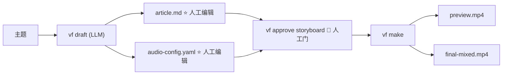
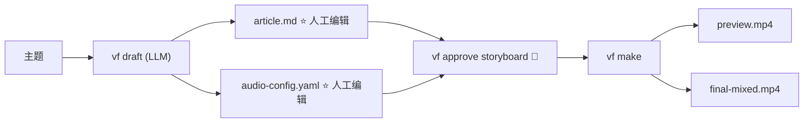

# AI Video Factory 安装与使用手册

本文档说明当前仓库的实际安装方式、CLI 命令和完整使用流程。

## 概览

AI Video Factory 的对外核心接口是 **2 个 AI 命令 + 1 次人工批准** ——
一条 LLM 命令写入所有辅助文件（article.md + audio-config.yaml），
人工读完并批准 storyboard 后，一条命令完成剩下的所有事情：



两个人工编辑文件就是 **`article.md`**（叙事 + Scenes YAML 块）和
**`audio-config.yaml`**（voice / bgm / sfx / fades）。其它一切都是派生
产物，编辑后 `vf make` 一键重跑。

渲染前有一道**强制人工门**：storyboard 未批准时 `vf make` 会在渲染步
失败并打印确切的批准命令（直接调 `vf preview --force` 可绕过，但会
记录在审计轨迹里）。三道门与不变量见 `docs/workflow.md`；VDSL 格式
见 `docs/schema.md`；系统架构见 `docs/architecture.md`。

## 1. 环境要求

必须安装：

- Node.js 22 或更高版本
- npm
- FFmpeg，且包含 `ffprobe`
- macOS、Linux，或可运行 POSIX shell 的 Windows 环境

检查版本：

```bash
node --version
npm --version
ffmpeg -version
ffprobe -version
```

macOS：

```bash
brew install node ffmpeg
```

Debian / Ubuntu：

```bash
sudo apt-get update
sudo apt-get install -y ffmpeg
```

Windows 请安装 Node.js 和 FFmpeg，并确保 `node`、`ffmpeg`、`ffprobe` 已加入 `PATH`。

## 2. 安装项目

在仓库根目录执行：

```bash
pnpm install
pnpm run build
```

CLI 编译后位于：

```bash
node packages/cli/dist/index.js --help
```

可在当前 shell 中设置简写：

```bash
alias vf='node packages/cli/dist/index.js'
```

也可以使用仓库提供的 wrapper：

```bash
bin/video --help
```

### 全局安装

发布 `@vf/*` packages 后，用户可以全局安装 CLI：

```bash
npm install --global @vf/cli
vf --help
```

全局安装只安装 CLI 和运行时依赖，不会把项目文件写入 npm 的全局安装目录。项目会创建在当前工作目录，或 `--cwd` 指定的目录下：

```bash
mkdir my-video-projects
cd my-video-projects
vf new demo
```

本地开发时可以链接 workspace CLI：

```bash
npm run build
npm link --workspace @vf/cli
vf --help
```

维护者发布全部 workspace packages：

```bash
npm run publish:packages:dry-run
npm run publish:packages
```

修改源码后需要重新构建：

```bash
npm run build
```

## 3. 验证安装

```bash
npm run build
pnpm test
pnpm run lint
pnpm run format:check
```

完整验收和 benchmark：

```bash
npm run benchmark:verify
pnpm run acceptance
```

这两个命令会实际渲染视频，因此需要 FFmpeg、ffprobe 和可用的本地 Remotion 渲染环境。

## 4. 创建项目

创建 `projects/demo`：

```bash
node packages/cli/dist/index.js new demo
```

生成的目录包括：

```text
projects/demo/
├── project.yaml
├── storyboard/storyboard.yaml
├── vdsl/vdsl.yaml
├── assets/audio/
├── assets/images/
├── assets/fonts/
├── captions/
├── checkpoints/
├── runs/
├── output/
└── state.yaml
```

主要输入文件是：

```text
projects/demo/storyboard/storyboard.yaml
```

项目初始状态为 `DRAFT`。当前工作流状态保存在 `state.yaml`，每次执行记录保存在 `runs/`。

## 5. Storyboard / VDSL 格式

schema 支持 `0.1` 与 `0.2`（0.2 字段全部可选，两者都通过校验）。
权威参考是 `docs/schema.md`（实现位于 `packages/vdsl/src/schema.ts`，
zod 严格模式——未知字段一律拒绝；校验错误带 YAML 行号）。
时长单位是秒，编译器按 `Math.round(duration × fps)` 转换为帧。

```yaml
schema_version: "0.1"   # 或 "0.2"

project:
  id: demo
  language: zh-CN        # zh-CN | en-US
  fps: 30
  width: 1920
  height: 1080

style:
  theme: dark-tech

assets:                  # 0.2：可选的项目级素材清单
  - id: asset-logo
    type: svg            # svg|png|jpg|webp|excalidraw|canvas|audio|video|font
    source: generated    # generated|user|external
    path: assets/svg/logo.svg

scenes:
  - id: scene-01
    duration: 8
    narration:
      text: "AI Agent 为什么需要 Memory？"
      audio: assets/audio/scene-01.wav   # 可选；vf audio 流程会挂载
    visual:
      component: SvgScene
      renderer: svg      # remotion（默认）| svg | canvas | excalidraw
      props: { … }       # 按 REGISTRY 中该组件的 props schema 校验
    animation:           # v0.1 入场模型（仍然有效）
      entrance: fade
      emphasis: none
      exit: none
    animations:          # 0.2 时间线模型（场景内相对时间）
      - id: draw-arrow
        target: arrow-1
        type: draw       # draw|write|fade|move|scale|rotate|highlight|morph|camera
        start: 1.2
        duration: 0.8
        easing: easeInOut   # linear|easeIn|easeOut|easeInOut（含同义词）
    captions:
      source: narration
    transition:
      in: fade           # fade|cut（含同义词）；默认 fade
      out: fade
```

重要规则：

- `schema_version` 必须是 `"0.1"` 或 `"0.2"`。
- Scene ID 必须唯一；每个 Scene 必须有正数 `duration` 和已注册的视觉组件。
- 组件必须在 `REGISTRY` 中注册，props 通过该组件的 schema 校验。
- 旁白音频文件必须存在且不超过场景时长（容差 0.05 秒）——先跑
  `vf preview` / `vf make`，它们会先把时长同步成实测音频长度再校验。
- 字幕必须能在底部安全区折成 ≤ 3 行、每行 ≤ 24 个 CJK 单位。
- 时间线动画必须落在场景内（`start + duration ≤ duration`）。
- LLM 同义词会在校验**之前**被归一化（`wipe`→`draw`、
  `hand-drawn`→`canvas`、`dissolve`→`fade`）；真正未知的值会响亮报错。

### 渲染器家族（visual.renderer）

| renderer | 组件 | 说明 |
| --- | --- | --- |
| `remotion` | REGISTRY 中任意经典组件 | 默认 |
| `svg` | `SvgScene` | 白板/示意图，draw-on 描画 + target 驱动运镜 |
| `canvas` | `DoodleScene` | 手写墨迹笔画，种子化抖动，`bpm` 对齐节拍 |
| `excalidraw` | — | 仅素材生成器（`vf excalidraw`），不是渲染路径 |

未接线的 renderer/组件组合会在渲染时响亮报错。

当前注册的 15 个组件：`Title`、`Paragraph`、`AnimatedIllustration`、
`CodeBlock`、`Terminal`、`Image`、`ImageBackground`、`FlowChart`、
`Comparison`、`Timeline`、`Callout`、`EndCard`、`Character`、
`SvgScene`、`DoodleScene`。

## 6. 本地核心流程（推荐）

新版把核心流程压缩成单个 `vf make`：

### 6.1 一次性准备：`article.md` + `audio-config.yaml`

```bash
vf new my-topic
vf draft "my-topic"           # → projects/<slug>/article.md + audio-config.yaml
                            #   同时刷新 storyboard.yaml（VDSL，由 article.md 派生）
# （vf audio-plan my-topic 只在手工修改 article.md 之后需要"重新生成"
#   audio-config.yaml 时才用——draft 命令已经自动跑过这一步）

# 人工编辑：
$EDITOR projects/<slug>/article.md
$EDITOR projects/<slug>/audio-config.yaml

# 🚪 人工门：读完 article.md（已镜像进 storyboard.yaml）后批准 storyboard
vf approve storyboard --cwd projects/<slug>
```

**未批准就跑 `vf make` 会在渲染步失败**，并打印这条确切指令：

```bash
preview: storyboard is not approved yet — read .../storyboard/storyboard.yaml (make flow: article.md), then run:
  vf approve storyboard --cwd <项目父目录>
```

`vf draft` 会自动对新草稿跑 audio-plan 步骤。两条护栏：`--no-audio-plan`
跳过该步骤（只出 article.md）；已存在的 `audio-config.yaml` 绝不会被
覆盖——人工编辑优先，命令会打印提示并指向 `vf audio-plan`。若
audio-plan 的 LLM 调用失败，draft 依然成功（article.md 是主产物），
并提示单独运行 `vf audio-plan`。

想从你自己的点子出发而不是空白主题时，传 `--file <path>` 指定一个
text 或 markdown 文件。LLM 会把它当作**主要想法 / 观点种子**——可
以润色措辞、结构和流畅度，但绝不能改变你表达的任何观点。（与
`--from` 互斥；`--from` 用于修订既有草稿。）

### 6.2 一键渲染：`vf make`

所有接收 `<project>` 参数的子命令都按同样的宽容顺序解析：

1. 指向项目根目录的路径（如 `./projects/my-video`）
2. `projects/` 下的精确文件夹名
3. 人类可读的主题——做 slug 化、忽略大小写与分隔符
   （`"Harness Engineering"`、`harness_engineering`、
   `harness-engineering` 指向同一个项目）
4. 唯一的文件夹名前缀（`vf make 长视频` 找到 `长视频测试`）

前缀有歧义时报错并列出候选；完全匹配不到时列出全部可用项目。

```bash
vf make my-topic                            # TTS → 音频素材 → 渲染 → 混音
vf make my-topic --fake                     # 离线：静音 WAV 占位 + 不调用 AI 生图
vf make my-topic --image-provider mock      # 强制用 mock 图（64×36 占位）做离线测试
vf make my-topic --image-provider minimax   # 强制用真 AI 生图（需要 MINIMAX_API_KEY）
vf make my-topic --bgm-dir ~/audio/bgm --sfx-dir ~/audio/sfx  # 用自己的音乐库做 BGM/音效
vf make my-topic --dry-run                  # 看会跑哪些步骤
```

`--fake` 是标准的离线模式：既跳过 Edge TTS（写静音 WAV 占位），也
跳过 AI 生图。场景保留 `AnimatedIllustration`（标题文字 + 动效
SVG），整段视频可全程离线渲染可见。仅当你需要刻意跑
`ImageBackground` 占位图路径时，才显式传 `--image-provider mock`。

`--bgm-dir` / `--sfx-dir` 指向你自己的音频库。audio-config.yaml 里的
标签（`bgm: calm`、`sfx: {scene_1: whoosh}`）会在目录里解析为
`{tag}.wav`（先精确匹配文件名，再退化为文件名包含标签的任意
`.wav`）。不传这两个 flag 时，audio-assets 步骤写的是 1 秒**静音
mock 占位**——混音机制照常运行，但压的是静音。传入后真实音频落到
`assets/audio-assets/`，`vf mix` 会把它垫在解说下方（压至约
-18 dB）。同目录的 `{tag}.license.txt` 会记录到 make 报告里，来源
可见。标签找不到时 `audio-assets` 步骤会可读地报错——补文件或去掉
该 cue 即可。

输出：

```text
projects/<slug>/output/preview.mp4           # 视频预览
projects/<slug>/output/preview-faststart.mp4 # 同上，faststart 元数据
projects/<slug>/output/final-mixed.mp4       # 解说 + BGM + 音效 — 发布件
projects/<slug>/assets/audio/scene_*.wav
projects/<slug>/assets/audio-assets/{bgm,sfx}/*.wav
projects/<slug>/captions/<lang>.srt
projects/<slug>/qa/render-report.json         # 每次渲染都写的 QA 报告
projects/<slug>/qa/contact-sheet.png          # 场景缩略接触表（人工快检）
projects/<slug>/scenes/                       # 逐场景 MP4 缓存（按内容哈希键控）
```

渲染是**场景隔离**的：每场先渲染成自己的 MP4 片段（`scenes/`，按
片段内容哈希 + 旁白音频状态键控），再拼接。只改 scene-007 就只
重渲染 scene-007。`vf preview --draft` 用低清档（960×540@15）渲染到
`scenes-draft/`，最终成片仍是 1080p30。渲染结束会汇总 QA 报告
（时长 / fps / 分辨率 / 音频 / 黑帧 / 素材 / 场景音画同步 / 字幕 /
边界），错误级发现会让步骤失败。

### 6.3 修改后重跑

`vf make` 是**幂等**的：比源文件新的产物会被跳过。所以修改
`article.md` 或 `audio-config.yaml` 后重跑会只跑受影响的部分。

```bash
# 只改了 audio-config 里的 BGM
vf make my-topic
# → 跳过已经新鲜的 TTS 与 preview；重新跑 audio-assets 与 mix
```

### 6.4 校验文件格式

```bash
node packages/cli/dist/index.js validate \
  projects/<slug>/storyboard/storyboard.yaml \
  --root projects/<slug>
```

错误信息包含文件、行号、字段和具体原因。


## 7. 编辑、迭代与恢复

### 7.1 三道人工门（由工作流状态强制，不是聊天式"请确认"）

| 门 | 命令 | 拦住什么 |
| --- | --- | --- |
| Storyboard | `vf approve storyboard` | 未批准时 `vf preview` / `vf make` 渲染步拒绝执行（`--force` 可绕过，但会记录） |
| Review | `vf approve review` | 未批准时 `vf final` 拒绝执行 |
| Final | `vf final`（QA 门） | QA 报告里的**错误级**发现会拦截导出（`--force` 可绕过，记录在案） |

改完文件重跑前，注意**阶段守卫（stage guard）**：生成器命令
（`research` / `script` / `storyboard` / `audio` / `motion`）拒绝覆盖
已人工批准的阶段或 FINAL_APPROVED 的项目，除非加 `--force`（打印
警告）。所以典型循环是：

```bash
# 改了 article.md 的某段叙事
$EDITOR projects/<slug>/article.md
vf approve storyboard --cwd projects/<slug>   # 重新读、重新批准
vf make <slug>          # 只重跑 TTS + render + mix（其余跳过）

# 改了 audio-config.yaml
$EDITOR projects/<slug>/audio-config.yaml
vf make <slug>          # 只重跑 audio-assets + mix

# 想给某一场换组件（比如用 Image 替代 Paragraph）
$EDITOR projects/<slug>/storyboard.yaml
vf make <slug>          # 只重跑 render + mix（场景隔离缓存：别的场景直接复用）
```

`vf make` 的发布件就是 `final-mixed.mp4`；走完整 agent 流水线的项目
则以 QA 门 + review 门后的 `vf final` 收尾。

### 7.2 场景级循环（整个系统的意义所在）

场景是最小可编辑单元，每场带版本历史：

```bash
vf scene list <slug>              # 每场的版本列表（含已批准标记）
# …编辑 storyboard.yaml（或让 agent 重新生成某一场）…
vf preview <slug>                 # 只重渲染改过的场景
vf scene approve <slug> scene-05  # 持久化"你批准的是哪个版本"
vf scene restore <slug> scene-05 1  # 回滚到该场的版本 1
```

### 7.3 Remotion Studio 实时预览

```bash
vf studio <slug> [--port 3000]    # 在 Remotion Studio 中打开项目
```

每次启动都从 storyboard 重新生成 Studio 工作区——适合在渲染 mp4
之前反复调视觉细节。

### 7.4 恢复

- `vf resume` — make 流项目重跑幂等流水线；CLI 流项目打印状态 +
  下一步的确切命令。
- `vf rollback <checkpoint-id>` — 校验 id、标记下游 checkpoint 失效、
  回到 DRAFT/<目标阶段>；从不覆盖产物（内容回滚走 `vf scene restore`）。
- `vf reset [stage] [--force]` — 倒回；把目标 checkpoint 标记为
  invalidated，而不是伪造一次批准。

### 7.5 关于手改 `storyboard.yaml`

`storyboard.yaml` 是 `article.md` 的派生文件，每次 `vf draft` 跑都会
重新生成。另外，`vf make` 在 TTS 后会按实测音频长度校正每场
`duration:` —— 没有这一步，渲染器会用文章里估算的时长，音频放完时画面
还卡在最后帧。

如果你手工编辑了 `storyboard.yaml`（例如换 `Image` 组件或调 `props`）：

- 每场 `duration:` 和其他 `vf draft` 派生的字段，下次 `vf draft` 时
  会被覆盖。
- 每场 `duration:` 在下次 `vf make` 时也会被覆盖（实测后重写）。
- 其它字段（组件、props、subtext 等）因为 `syncStoryboardDurations`
  只动 `duration:` 行，所以会被保留。

常见流程：

- 想让 `vf draft` 出来的内容去噪 → 直接编辑 `article.md`
- 想做像素级的视觉控制 → 手工编辑 `storyboard.yaml` 后跑 `vf make`
  （**不要**再跑 `vf draft`，否则会覆盖）


## 8. 可选 AI 工作流

AI 命令调用 MiniMax 或 GLM API；纯本地渲染不依赖它们。
密钥**只放在环境变量**，不要写到 Git：

```bash
export MINIMAX_API_KEY="..."
export GLM_API_KEY="..."        # vf draft / vf audio-plan 默认使用 GLM
```

自定义 provider 路由：

```bash
export LL_CONFIG="$PWD/llm.config.yaml"
```

### 配额 / 限流自动降级到 fallback

当 primary provider 返回配额或限流错误（HTTP 429 / 402 / 403，
或响应体里包含 `insufficient_balance`、`quota_exceeded`、
`rate_limit`）时，每个 AI 命令会自动用配置的 fallback 重试一次，不会
直接报错。真正服务的 provider 会写到 `runs/<id>.yaml` 的 `provider:`
字段里，方便审计是否触发了降级。

按命令临时指定 provider：

```bash
vf draft "topic" --model minimax   # 强制用 minimax（不会降级到 glm）
vf storyboard "topic" --model glm --lang en-US
```

非配额类错误（例如 HTTP 400 输入不合法）**不会**触发降级，因为同样的
输入在 fallback 上也是同样的错，会直接报错。

### 推荐：`vf draft`（合并 audio-plan）+ 批准 + `vf make`

新版 AI 工作流只有这几步 — 全部内聚到两个人类可编辑的产物：

```bash
# 1. 一条命令写两个文件：article.md（一篇可编辑的长 markdown + Scenes
#    YAML 块）和 audio-config.yaml（voice / bgm / sfx / fades）。
#    --no-audio-plan 跳过 audio 步；已有的 audio-config.yaml 不会被覆盖。
vf draft "AI Agent Memory"
vf draft "AI Agent Memory" --no-web
vf draft "AI Agent Memory" --model glm --lang zh-CN --duration 60 --audience developers
vf draft "AI Agent Memory" --from draft-outline.md   # 基于已有大纲改写
vf draft "AI Agent Memory" --file my-idea.md         # 用你的原始想法做种子（观点保留）
vf draft "AI Agent Memory" --no-audio-plan          # 仅写 article.md

# 2. 🚪 人工门：读完 article.md 后批准 storyboard
vf approve storyboard --cwd projects/ai-agent-memory

# 3. 渲染 mp4 —— TTS → 音频资源 → 渲染 → 混音（每次渲染附 QA 报告）
vf make ai-agent-memory
```

### 完整 agent 流水线（细粒度，含 v0.2 新动词）

想逐阶段控制（或使用 `vf make` 覆盖不到的能力——运镜规划、图表
素材、QA 复检）时，规范顺序是：

```bash
vf new "<slug>"
vf research "<topic>"          # 可选，给 script/storyboard 供料
vf script "<topic>" --from-research …
vf storyboard "<topic>" --from-research … --from-script …
vf approve storyboard --cwd projects/<slug>     # 🚪 人工门 1
vf motion <slug> [--bpm 100]                    # Motion Agent（LLM + 确定性兜底）
vf audio <slug>                                 # TTS → 逐场景 WAV + 字幕
vf excalidraw <slug>                            # 图表场景 → .excalidraw + 动画 SVG
vf review <slug>                                # 只读 Content/Visual/Technical 评审
vf preview --cwd projects/<slug>                # QA 报告 + 接触表（进入 WAITING_REVIEW）
vf qa <slug>                                    # 重建 QA 报告；错误级发现退出码 1
vf approve review --cwd projects/<slug>         # 🚪 人工门 2
vf final --cwd projects/<slug> [--mix]          # 🚪 人工门 3（QA 门）→ FINAL_APPROVED
vf youtube <slug>                               # 发布元数据
```

### `vf motion` — Motion Agent

为每场规划时间线动画与转场（写入 storyboard 的 `animations:` /
`transition:`）：

```bash
vf motion my-topic                  # LLM 规划（provider 按 motion 角色路由）
vf motion my-topic --bpm 120        # 入场/强调时刻对齐节拍网格
vf motion my-topic --scene scene-03 # 只规划一场
vf motion my-topic --baseline       # 跳过 LLM，直接套确定性启发式
```

### `vf excalidraw` — 图表素材生成器

把 storyboard 里每个 `svg`/`SvgScene` 场景转成**可手工编辑**的
`.excalidraw` 文件 + 独立动画 SVG（落到 `assets/excalidraw/`）：
`vf excalidraw my-topic [--duration 8]`。没有图表场景时会提示并退出。

### `vf qa` — QA 复检

随时重建当前预览的 QA 报告（`qa/render-report.json`）；默认严格模式
发现错误级问题时退出码 1，`--no-strict` 只报告不失败：

```bash
vf qa my-topic
vf qa my-topic --no-strict
```

输出：

```text
projects/<slug>/article.md            # 人类编辑：叙事、结构、Scenes YAML
projects/<slug>/audio-config.yaml     # 人类编辑：voice / bgm / sfx / fades
```

人类编辑完两个文件后，跑 `vf make <slug>` 即出一份发布 mp4。


### YouTube 元数据

不是 `vf make` 的一部分，需要时单独调：

```bash
vf youtube <slug>
```

生成标题、简介、WebVTT chapters、结构化 YAML、缩略图提示词与 Shorts hook。
它**不会**上传 YouTube，也**不会**生成缩略图或 Shorts MP4（那两个由 §12.5
中的 `vf thumbnail` 和 `vf shorts` 产出）。

## 9. 语音、字幕和音频

### 9.1 推荐路径：整合在 `vf make` 中

当前版本，TTS、BGM/SFX 素材、混音、字幕 SRT 都由 `vf make` 一次性产出 ——
不再需要单独跑 `vf audio` / `vf audio-asset` / `vf mix`：

```bash
vf make <slug>            # 真 Edge TTS（需要网络）
vf make <slug> --fake     # 静音 WAV 占位 + 不调用 AI 生图（无需网络，离线 / CI 友好）
vf make <slug> --image-provider minimax  # 强制走真 AI 生图（非 --fake 时的默认）
```

默认使用 Edge TTS（免费、无需 API key），但依赖在线 Microsoft 服务，
可能受限流或网络故障影响。

`--fake` 同时跳过 AI 生图（无需 `MINIMAX_API_KEY`）。场景保留
`AnimatedIllustration`（标题文字 + 动效 SVG），整段视频可全程离线
渲染可见。需要 `--image-provider mock`（占位图）或
`--image-provider minimax`（真 AI）时显式指定。

默认情况下，audio-config.yaml 里的 BGM/SFX 标签会物化成 1 秒**静音
mock 占位**——混音机制照常运行，但没有真实音乐。把 `vf make` 指向
你自己的音频库即可得到真实音频（`--bgm-dir`、`--sfx-dir`，见
§6.2），或者自行预置 `assets/audio-assets/{bgm,sfx}/{tag}.wav`
（幂等的 make 会保留已有文件）。

输出：

```text
projects/<slug>/assets/audio/scene_*.wav
projects/<slug>/assets/audio-assets/bgm/<tag>.wav
projects/<slug>/assets/audio-assets/sfx/<tag>.wav
projects/<slug>/captions/<lang>.srt
```

字幕格式是标准 WebVTT-兼容 SRT（实际后缀是 .srt 但内容是 SRT）。

### 9.2 句间停顿（`pause_between_sentences_sec`）

TTS 输出句与句之间可以插入静默停顿，写在 `audio-config.yaml` 中：

```yaml
voice: zh-CN-XiaoxiaoNeural
bgm: "calm"
bgm_fade_in_sec: 1.5
bgm_fade_out_sec: 2
pause_between_sentences_sec: 1     # 在每个句号 / 问号 / 感叹号之后停 1 秒
sfx: {}
```

- 范围 `0–5`（秒）；`0` 禁用。
- 实现方式：`vf make` 在调 TTS 时把文本包成 SSML
  `<speak>第一句。<break time="1000ms"/>第二句。</speak>`，
  Edge TTS 在那个 `break` 处插入静音。
- 典型取值 `0.5–1.0`（明显但不拖沓）。`vf audio-plan` 默认填 0；
  人类编辑时如果场景里有 2+ 句，可以提升到 1.0 左右。

只改 `pause_between_sentences_sec` 后再跑 `vf make`，只重跑 TTS
那一步，其它产物按 mtime 跳过。

### 9.3 音色选择

默认音色取决于 article 的 `language` 字段。想按项目自定义，改
`audio-config.yaml` 里的 `voice:`；想改全局默认，改
`packages/make/src/index.ts` 的 `ZH_VOICE` / `EN_VOICE` 常量并重新构建。

| 语言 | 默认（男声） | 女声备选 | 其它男声备选 |
| --- | --- | --- | --- |
| `zh-CN` | `zh-CN-YunjianNeural`（纪录片风格） | `zh-CN-XiaoxiaoNeural` | `zh-CN-YunxiNeural`（温暖）、`zh-CN-YunyangNeural`（新闻） |
| `en-US` | `en-US-ChristopherNeural`（平静旁白） | `en-US-AriaNeural` | `en-US-GuyNeural`、`en-US-EricNeural` |

任何 Edge TTS 支持的 voice ID 都可以用 — 直接写到 `audio-config.yaml`
的 `voice:` 字段即可。除非显式覆盖，文章一直使用默认男声。

### 9.4 Edge TTS 注意事项

Edge TTS 不收取直接 API 费，但商业再分发和长期生产使用应先确认服务
条款。需要正式授权的生产服务时，可通过 `@vf/tts` 的 `TTSProvider`
接口替换（例如 MiniMax TTS / ElevenLabs）。


## 10. 项目文件和可追溯性

### 推荐结构

```text
projects/<slug>/
├── project.yaml                     项目元数据
├── article.md                       ⭐ 可人工编辑：叙事 + Scenes YAML（vf draft 写）
├── audio-config.yaml                ⭐ 可人工编辑：voice / bgm / sfx / fades（vf audio-plan 写）
├── storyboard/storyboard.yaml       vf draft 从 article.md 派生；vf make 在 TTS 后按实测时长校正每场 duration（手改其他字段保留；duration 会被下次 make 覆盖）
├── vdsl/vdsl.yaml                   编译后的标准 VDSL（确定性编译；损坏时响亮回退到 storyboard）
├── state.yaml                       工作流状态机（10 态；门与守卫的依据）
├── checkpoints/<stage>.yaml         人工门审计轨迹（approved/rejected/invalidated）
├── runs/<run-id>.yaml               每次 LLM / tool 调用的 run 记录
├── scenes/                          逐场景 MP4 缓存（内容哈希键控；final 1080p30）
├── scenes-draft/                    低清草稿缓存（--draft：960×540@15）
├── qa/
│   ├── render-report.json           每次渲染写的 QA 报告（vf qa 可重建）
│   └── contact-sheet.png            场景接触表（人工快检）
├── assets/
│   ├── audio/scene_*.wav           逐场景 TTS（vf make 写）
│   ├── audio-assets/{bgm,sfx}/     BGM/SFX 素材（vf make 写）
│   └── excalidraw/                 vf excalidraw 写：.excalidraw + 动画 SVG
├── captions/<lang>.srt              字幕（vf make 写）
├── youtube/                         vf youtube / thumbnail / shorts 的发布包
└── output/
    ├── preview.mp4                  vf make 写
    ├── preview-faststart.mp4        vf make 写
    └── final-mixed.mp4              ⭐ 发布件（vf make 写）
```

`⭐` 标记的是两个人类编辑点；其余都是派生产物。

`storyboard.yaml` 是 **article.md 的派生**（由 `vf draft` 在每次
draft 运行时从 `article.md` 同步生成）。第一场映射到 `Title` 组件，
其余场映射到 `Paragraph` 组件，`caption` 作为屏显文字。如果想要像素
级别的视觉控制（例如换 `Image` 组件或调整 `props`），可以手工编辑
`storyboard.yaml` 后跑 `vf make` —— 但下一次 `vf draft` 会把它
**覆盖**回去。如果手改很重要，跑 `vf make` 之前不要重新跑 `vf draft`。

### AI 调用记录字段

`runs/<run-id>.yaml` 每条记录包含 `provider`、`model`、
`tokens` (`{input, output}`)、`prompt_hash`、`estimated_cost_usd`、
`input_files` 与 `output_files` 引用、ISO 时间戳。

**绝不要**把 API key、`.env`、私有资料、Token、Cookie 等凭据提交到仓库。

## 11. 常见问题

### 找不到 FFmpeg 或 ffprobe

安装 FFmpeg，并确认命令在 `PATH` 中：

```bash
which ffmpeg
which ffprobe
```

### 找不到 `packages/cli/dist/index.js`

重新构建：

```bash
npm run build
```

### 缺少 MiniMax 或 GLM key

在运行命令的同一个 shell 中导出对应环境变量。

### Validation 报告素材不存在

`assets/audio/scene_01.wav` 这类路径相对于项目根目录，而不是 YAML
文件所在目录。使用 `--root` 指定项目根目录。

### `vf make` 一上来就报错

`vf make` 需要 `article.md` 和 `audio-config.yaml` 两个文件都在
`projects/<slug>/`。两个文件都不在时报：

```bash
article.md not found at .../article.md
# hint: run `vf draft <topic>` first

audio-config.yaml not found at .../audio-config.yaml
# hint: run `vf draft <topic>` first
```

### `preview: storyboard is not approved yet`

渲染前的人工门：storyboard 尚未被批准。读完
`projects/<slug>/storyboard.yaml`（make 流对应 `article.md`）后执行
报错信息里给出的命令：

```bash
vf approve storyboard --cwd <项目父目录>
```

确要跳过时 `vf preview --force`（打印 `[FORCE]` 警告并记录到审计
轨迹）。注意阶段守卫会阻止生成器覆盖已批准的阶段——重新生成前需要
`--force` 或先 `vf rollback` / `vf reset`。

### `vf final` 被 QA 门拦下（`qa-gate: N error-level finding(s)`）

导出前 QA 复检发现错误级问题（时长/黑帧/音画不同步/素材缺失等）。
打开 `qa/render-report.json` 按条目修复（每条带修复建议），重跑
`vf preview` 后再 `vf final`。确认要带病导出时用
`vf final --force`（失败的门会留在 run 历史里）。

### Edge TTS 失败

检查网络并重试；离线 / CI 用：

```bash
vf make <project> --fake
```

### `article.md 场景旁白为空`

偶尔 LLM 会把全部正文写进 `## N. ...` 小节，而每个场景的
`narration:` 字段留空。所有读取 article.md 的命令（`vf make`、
`vf audio-plan`、`vf youtube`）现在会自动恢复——把小节正文按句子
分配到空场景，并在输出里提示恢复了几个场景（`vf make` 的报告里
对应 `recover-narrations` 步骤）。

想重新生成一份干净的草稿：

```bash
vf draft <topic> --from projects/<slug>/article.md
```

CI 场景下想让 `vf audio-plan` 保持原有的报错行为：

```bash
vf audio-plan <project> --strict
```


### Remotion 无法找到端口

可能是其他渲染进程占用端口，或当前执行环境禁止本地 loopback。停止
残留进程后重试，并确认本地端口绑定权限。

### 磁盘占用增长很快（`node_modules` / `/tmp`）

两个临时目录会在高频使用下持续累积：

- **`node_modules/.cache/webpack`** — Remotion 的持久化 webpack 缓存。
  每次渲染配置变化都会增量增长。直接删除即可，下次渲染会重建。

  ```bash
  rm -rf node_modules/.cache/webpack
  ```

- **系统 `$TMPDIR`**（macOS 默认 `$TMPDIR`、Linux 默认 `/tmp`）—
  每次 Remotion 渲染会留下 `remotion-webpack-bundle-*` 与
  `remotion-v*-assets-*` 目录。每个渲染 ~26MB；几百次测试/make
  跑下来可以积到几十 GB。`vf make` 每次渲染会自动清理 1 小时前
  的条目，但本地直接跑 `vf preview` 时不一定走这条路径。立即清理：

  ```bash
  # macOS 默认：
  rm -rf "$TMPDIR"/remotion-webpack-bundle-* "$TMPDIR"/remotion-v*-assets*
  # Linux：
  rm -rf /tmp/remotion-webpack-bundle-* /tmp/remotion-v*-assets*
  ```

## 12. 一步步：从一个主题开始创建视频

### 12.0 推荐：最小 API（2 个 AI 命令 + 1 次人工批准）

整个流水线被压缩到 **2 个命令 + 1 次人工批准 + 2 个人工编辑点 + 1 个渲染输出**：

1. `vf draft <topic>` → 写出 `article.md` 和 `audio-config.yaml`（一次 LLM 调用合并 research + script + storyboard + audio plan；`--no-audio-plan` 跳过 audio 步；`--file <path>` 用你的原始想法作为主要观点种子（润色措辞，观点保留）；已有的 `audio-config.yaml` 不会被覆盖，重新生成用 `vf audio-plan`）
2. `vf approve storyboard` → 🚪 人工门：读完 article.md 后批准（未批准时 `vf make` 在渲染步失败并给出这条命令）
3. `vf make <project>` → 一切自动：TTS → 音频素材 → 渲染（场景隔离 + QA 报告）→ 混音 → 输出 mp4



`vf make` 是**幂等**的：已产出的 WAV / mp4 比源文件新就跳过；先用
`--dry-run` 看会跑哪些步骤。

### 12.1 一次性安装

```bash
# ffmpeg（所有流程的必需依赖）+ Node 22+
brew install ffmpeg                 # macOS；Debian/Ubuntu: sudo apt install ffmpeg

git clone https://github.com/huangjien/ai-video-factory.git
cd ai-video-factory
npm install
npm run build
```

### 12.2 创建一个项目

```bash
TOPIC="ai-thinking"
vf new "$TOPIC"
# 会创建 projects/<slug>/ 目录：
#   project.yaml
#   storyboard/storyboard.yaml    (模板 — 2 个场景，供 vf make 渲染用)
#   state.yaml
#   runs/, checkpoints/, output/, assets/, 等
```

### 12.3 LLM 草稿（推荐路径）

需要环境中的 `GLM_API_KEY`（默认值；`MINIMAX_API_KEY` 作为可选 fallback）。

```bash
# 1. Draft — 写 article.md（同时承担 research + script + storyboard 三件事）
#    输出 projects/<slug>/article.md：
#      - YAML frontmatter（project / language / duration_target_sec / voice）
#      - # <title> + > **Hook**
#      - ## <n>. <Section> + <body> 段落（人类可改）
#      - ## Scenes  围栏 YAML 块（驱动器下游工具）
#    同时派生 storyboard.yaml（VDSL），第一场映射到 Title，其余到 Paragraph，
#    caption 作为屏显文字。vf make 渲染的就是这个文件，所以视频长度
#    与音频自动对齐。
vf draft "$TOPIC"                  # 默认开启 MiniMax 联网搜索
vf draft "$TOPIC" --no-web          # 关闭联网，纯模型知识
vf draft "$TOPIC" --model glm --duration 40 --lang zh-CN --audience developers
vf draft "$TOPIC" --from outline.md  # 把已有大纲当起点改写
vf draft "$TOPIC" --file my-idea.md  # 用你自己的想法做种子，观点保留
```

```bash
# 2. Audio-plan —— 可选：vf draft 已经自动跑过这一步。仅在手工修改
#    article.md 之后想"重新生成" audio-config.yaml 时才需要。
#    一个文件装下所有音频旋钮（voice / bgm tag / sfx cues / fades）
vf audio-plan "$TOPIC"
```

然后人工编辑这两个文件：

```bash
$EDITOR "projects/$TOPIC/article.md"          # 改叙事、删场景、调时长
$EDITOR "projects/$TOPIC/audio-config.yaml"   # 换 BGM、加音效、调 fade
```

### 12.4 渲染（先批准，再一个命令搞定）

```bash
# 🚪 人工门：读完 projects/$TOPIC/article.md 后批准 storyboard
# （--cwd 直接指向项目目录；也可用 vf approve storyboard --cwd projects
#   让它在 projects/ 下只有一个项目时自动发现）
vf approve storyboard --cwd "projects/$TOPIC"

vf make "$TOPIC"                     # TTS → 音频资产 → 渲染 → 混音（真 Edge TTS）
vf make "$TOPIC" --fake              # 用 FakeTTSProvider（无需网络，静音 WAV 占位 + 不调用 AI 生图）
vf make "$TOPIC" --image-provider minimax  # 强制走真 AI 生图
vf make "$TOPIC" --dry-run           # 只打印会跑哪些步骤，不真正执行
```

`--fake` 同时跳过 Edge TTS 和 AI 生图，所以渲染完全离线 —— 场景
保留 `AnimatedIllustration`（标题文字 + 动效 SVG）。需要刻意走
`ImageBackground` 占位图路径时用 `--image-provider mock`。

输出：

```text
projects/$TOPIC/output/preview.mp4           # 视频预览（仅画面）
projects/$TOPIC/output/preview-faststart.mp4 # 同上，faststart 元数据
projects/$TOPIC/output/final-mixed.mp4       # 解说 + BGM + 音效的发布件
projects/$TOPIC/assets/audio/scene_*.wav     # 每场景 TTS（可重新编辑 article.md 后再跑覆盖）
projects/$TOPIC/assets/audio-assets/bgm/*.wav
projects/$TOPIC/assets/audio-assets/sfx/*.wav
projects/$TOPIC/captions/<lang>.srt
projects/$TOPIC/qa/render-report.json        # QA 报告（含黑帧/音画同步/字幕等检查）
projects/$TOPIC/qa/contact-sheet.png         # 场景接触表
```

不满意？改 `article.md` 或 `audio-config.yaml` 任意一处，再跑一次
`vf make` — 没改的部分会跳过，改了的部分从那一步重跑。

### 12.5 可选：YouTube 发布包 + 缩略图 + Shorts

发布到 YouTube 的元数据，单独调用（不是 `vf make` 的一部分）：

```bash
# YouTube 文本包 — 标题、描述、chapters.vtt、缩略图提示、Shorts hook
vf youtube "$TOPIC"
# 优先读 article.md；如果不存在则回退到 research.md + script.md + storyboard.yaml
# → projects/$TOPIC/youtube/{title.txt,description.md,chapters.vtt,thumbnail-prompt.txt,shorts-hook.txt}

# 缩略图 — 默认 mock；加 --provider minimax 走真实 AI
vf thumbnail "$TOPIC"
# → projects/$TOPIC/youtube/thumbnail.png（1280×720）

# Shorts 切片 — 从 final-mixed.mp4 抽一段竖屏 9:16
vf shorts "$TOPIC"
# → projects/$TOPIC/youtube/shorts.mp4
```

`vf youtube` 在新版下不再要求旧的 `research/`、`script/`、
`storyboard/storyboard.yaml` 三件套都存在 —— 只要 `article.md` 在就
够。所有信息（标题、hook、章节、时长）都从 `article.md` 推出来。

两个命令都加 `--provider minimax` 走真实 AI（需要 `MINIMAX_API_KEY` + 配额）：

```bash
vf thumbnail "$TOPIC" --provider minimax
vf shorts "$TOPIC"     --provider minimax
```

### 12.6 查看产出

```bash
ls "projects/$TOPIC/output/"
ls "projects/$TOPIC/assets/audio/"
ls "projects/$TOPIC/assets/audio-assets/"
ls "projects/$TOPIC/captions/"
ls "projects/$TOPIC/runs/"            # 每次 agent / tool 调用一条 run 记录
```

### 12.7 一段复制粘贴即可运行的完整流程

假设 `vf` 在 PATH 中、`GLM_API_KEY` 已设置（没有就加 `--fake`）：

```bash
TOPIC="ai-thinking"
vf new "$TOPIC"
vf draft "$TOPIC"                     # 一条命令写 article.md + audio-config.yaml + 派生 storyboard.yaml
# （仅在手工修改 article.md 后想重新生成 audio-config.yaml 时才用）
# vf audio-plan "$TOPIC"

# 人工编辑文章与音频计划（任意编辑器）
$EDITOR "projects/$TOPIC/article.md"
$EDITOR "projects/$TOPIC/audio-config.yaml"
# 比如想让每句之间停 1 秒，把它写进 audio-config.yaml：
#   echo 'pause_between_sentences_sec: 1' >> "projects/$TOPIC/audio-config.yaml"

vf approve storyboard --cwd "projects/$TOPIC" # 🚪 人工门：读完 article.md 后批准
vf make "$TOPIC"                     # → preview.mp4 + final-mixed.mp4（附 QA 报告 + 接触表）

# 可选
vf scene list "$TOPIC"               # 看每场版本；vf scene approve/restore 做场景级回滚
vf studio "$TOPIC"                   # Remotion Studio 里实时调视觉
vf youtube "$TOPIC"                  # 现在 article.md 直接可用，无需 research/script/storyboard 三件套
vf thumbnail "$TOPIC"
vf shorts "$TOPIC"
```

最终发布件是 `projects/$TOPIC/output/final-mixed.mp4`，加上
`projects/$TOPIC/youtube/` 下的 YouTube 包。


## 13. 用验收脚本验证

跑完上面流程后，`npm run acceptance` 会在 `projects/benchmark-v01/`
参考项目上执行 §62.4 审计（39 秒的中文思维链讲解视频）。审计检查文件
格式、运行时和来源追溯，全程不需要 AI 介入。

```bash
npm run acceptance
# 预期："ALL 11 §62.4 acceptance checks passed"
```

## 14. 端到端示例项目（无需 LLM，确定性渲染）

`examples/` 下有三个提交进仓库的完整示例，覆盖 v0.2 的全部新能力，
不依赖任何 API key，可直接复制渲染：

| 示例 | 时长 | 演示什么 |
| --- | --- | --- |
| `examples/mcp-explainer` | 45 秒 | 完整流水线：SvgScene 图表 draw-on、显式 `animations[]`、DoodleScene 手绘、时长同步、场景版本、QA 报告/门、Excalidraw 素材生成 |
| `examples/ai-concept` | 60 秒 | 手绘 canvas + 节拍同步（100 BPM 网格） |
| `examples/devops-architecture` | 90 秒 | 图表、target 驱动运镜（camera）、cut/fade 转场、时间线编排、Excalidraw |

以 MCP Explainer 为例（完整序列见其 `README.md`）：

```bash
pnpm run build
node packages/cli/dist/index.js new mcp-explainer
cp examples/mcp-explainer/storyboard.yaml projects/mcp-explainer/storyboard/
cp examples/mcp-explainer/captions/zh-CN.srt projects/mcp-explainer/captions/
# 每场 9 秒静音旁白占位（或用 `vf audio` 生成真 TTS）
for i in 01 02 03 04 05; do
  ffmpeg -y -f lavfi -i anullsrc=r=44100:cl=mono -t 9 projects/mcp-explainer/assets/audio/scene-$i.wav
done
node packages/cli/dist/index.js approve storyboard --cwd projects/mcp-explainer   # 🚪 门 1
node packages/cli/dist/index.js preview --cwd projects/mcp-explainer              # QA 报告 + 接触表
node packages/cli/dist/index.js excalidraw mcp-explainer
node packages/cli/dist/index.js qa mcp-explainer
node packages/cli/dist/index.js approve review --cwd projects/mcp-explainer       # 🚪 门 2
node packages/cli/dist/index.js final --cwd projects/mcp-explainer                # 🚪 门 3（QA 门）
```

每个示例的 `README.md` 里有逐场景说明（组件家族 × 流水线特性），提交
的集成测试（`packages/cli/src/demo-*.test.ts`）会对临时项目跑同一序列。
想看新组件（`SvgScene` / `DoodleScene`）、时间线动画和运镜怎么写，
从这三个 storyboard 入手最快。
